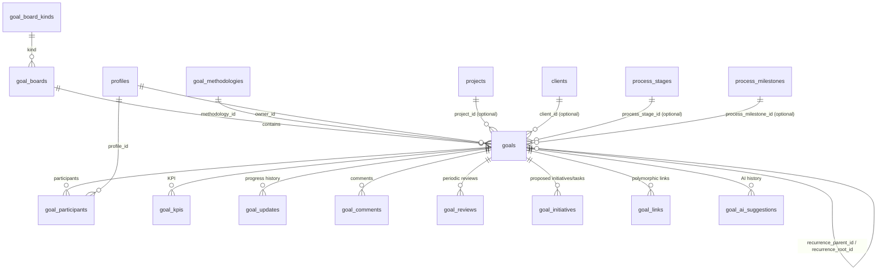

# Architektura — Tablica Celów (moduł „Przestrzenie”)

> Status: **projekt do implementacji** (nie wdrożone). Ten dokument zawiera architekturę,
> model danych i decyzje podjęte wspólnie z właścicielem produktu. Kolejne dokumenty w tym
> katalogu: `EKRANY_I_UX.md`, `STATE_MACHINE.md`, `AI_I_METODOLOGIE.md`,
> `PLAN_WDROZENIA.md`, `PYTANIA_I_RYZYKA.md`.

## 1. Umiejscowienie w aplikacji

Tablica Celów **nie jest nowym modułem w menu** — to kolejna pozycja w istniejącej grupie
„Przestrzenie” (`components/app-shell.tsx`), analogicznie do „Tablice wdrożeń”:

```
components/app-shell.tsx
  label: "Przestrzenie"
    /przestrzenie        — Przestrzenie (dashboard_spaces)
    /tablice-wdrozen      — Tablice wdrożeń (process_kanban_*)
    /tablice-celow        — Tablice celów (goal_*)              ← NOWE
    /przerwania
```

Dodatkowo cele będą widoczne kontekstowo (bez nowego modułu):
- nowa zakładka „Cele” w dashboardzie klienta/zespołu (`ClientDashboardView`), filtrująca po `project_id`/`client_id`,
- link „Cele” z widoku projektu.

## 2. Dlaczego samodzielny moduł, a nie rozszerzenie `process_item_kind`

Wzorzec Kanbanu Wdrożeń (`process_kanban_*`) jest 1:1 związany z jednym elementem szablonu
procesu jednego projektu. Cel (firmy/zespołu/osoby) istnieje niezależnie od procesu i **opcjonalnie**
odnosi się do projektu/procesu/etapu/kamienia milowego (0..1). To wymaga samodzielnego modelu
domenowego — wzorowanego na module Audytu SRI (`lib/audit/*`, `097_audit_mvp.sql`): jasny model
domenowy + biblioteka metodologii + silnik AI, oraz na module Przeglądów serwisowych
(`084_inspections.sql`): harmonogram, komentarze, `responsible_profile_id`.

## 3. Decyzje architektoniczne (ustalone z właścicielem produktu)

| # | Temat | Decyzja |
|---|---|---|
| D1 | Tablice vs. typy | `goal_boards` to **instancje tworzone przez użytkownika** — wiele tablic tego samego typu (`kind`) jest dozwolone (np. „Cele sprzedażowe 2026”, „Cele sprzedażowe — Zespół Warszawa Q1”). `kind` to tylko kategoria/etykieta z katalogu `goal_board_kinds`. |
| D2 | Kolumny tablicy | Kolumny = **status realizacji** celu (Planowanie → W realizacji → Zagrożony → Wstrzymany → Rozliczony), nie okres. Okres jest atrybutem/filtrem celu. |
| D3 | Poziomy (firma/zespół/osoba) | **Niezależne rekordy, bez automatycznego rollupu** procentu realizacji. Dozwolone jest opcjonalne, ręczne powiązanie `parent_goal_id` („ten cel wspiera tamten”), ale bez wyliczania progresu nadrzędnego z podrzędnych. |
| D4 | Cykliczność | Cel ma flag `is_recurring`. Po **rozliczeniu** cyklicznego celu system **automatycznie tworzy kolejną instancję** na następny okres (kopia struktury: tablica, poziom, właściciel, uczestnicy, metodologia, KPI), połączoną przez `recurrence_parent_id` / `recurrence_root_id`. |
| D5 | Widoczność „Cele zarządu” | Interim rozwiązanie: katalog `goal_board_kinds` ma kolumnę `visibility` (`all` \| `admin_only`). Tablice typu „Zarząd” są `admin_only` — widoczne/edytowalne tylko dla `is_administrator()`. **Pełna matryca uprawnień i widoczności (per zespół/rola/użytkownik) to odrębna, późniejsza faza** — nieobjęta tym wdrożeniem. |
| D6 | Zamykanie przeglądu | Przegląd (`goal_reviews`) może wymagać akcji (`requires_action`). Zamknąć może: **właściciel celu** (`owner_id`), **„przełożony”** (interpretacja robocza — profil z rolą `manager` lub `administrator`, bo appka nie ma dziś struktury podległości/hierarchii raportowania), albo uczestnik z rolą `reviewer` w `goal_participants`. |
| D7 | „Historia” | Dwa odrębne widoki: **(a)** zakładka „Historia” w widoku pojedynczego celu — techniczny log zmian (`goal_updates`); **(b)** nowy, samodzielny ekran analityczny **„Historia i wnioski”** (`/tablice-celow/historia`) — kto dowozi cele, jakie cele nie są dowożone, kto w ogóle ustala sobie cele, trendy w czasie. Patrz `EKRANY_I_UX.md`. |
| D8 | Powiadomienia | Potrzebne, kierowane do **właściciela celu** (rozszerzenie istniejącego `user_notifications` / `store/notification-store.ts`, wzorem `kanban_new_activity`). |
| D9 | AI | Kontynuacja z **OpenAI**, wzorem `lib/ai/service-estimate-generator.ts` (structured JSON, bez streamingu). **Bez limitu** wywołań na start. AI może sugerować **nie tylko przy tworzeniu, ale też w trakcie trwania celu** (np. przy przeglądzie). Wysyłanie opisu celu do OpenAI **nie wymaga dodatkowej zgody** (decyzja produktowa). |
| D10 | RLS | Wzorzec „open dla zalogowanych” (jak Kanban/Inspections) **akceptowalny na ten moment** dla całego modułu, z wyjątkiem D5 (tablice `admin_only`). |
| D11 | Etap/kamień milowy | Powiązanie celu z etapem/kamieniem milowym procesu odnosi się do definicji **szablonu** (`process_stages`/`process_milestones`, współdzielonych między projektami), rozróżnianej w kontekście `project_id` zapisanego na celu. |
| D12 | Katalog typów tablic | `goal_board_kinds` to tabela w DB (nie Postgres enum) — łatwe dodawanie nowych typów. Edycja z UI administratora to **późniejsza faza**; na MVP katalog seedowany migracją. |
| D13 | KPI | `current_value` wpisywane manualnie w MVP. Kolumna `source` (`manual`\|`system`) przygotowana pod przyszłą automatyzację (np. zasilanie z ofert/zgłoszeń serwisowych), ale niewykorzystywana teraz. |
| D14 | Wersjonowanie szablonów metodologii | Nie wdrażamy pełnego wersjonowania w MVP; kolumna `schema_version` (default `1`) zarezerwowana na przyszłość. |

## 4. Diagram relacji (ERD)



## 5. Model danych (finalna propozycja SQL — do wdrożenia w Fazie 0)

```sql
-- ── Katalog typów tablic (table-driven, nie enum) ───────────────────────────
create table if not exists public.goal_board_kinds (
  code text primary key,             -- 'sales','project','service','quality','development',
                                      -- 'financial','executive','marketing','training', ...
  label text not null,
  description text not null default '',
  icon text not null default 'target',
  visibility text not null default 'all' check (visibility in ('all', 'admin_only')),  -- D5
  sort_order int not null default 100,
  is_active boolean not null default true
);

-- ── Tablice celów — WIELE instancji per typ (D1) ────────────────────────────
create table if not exists public.goal_boards (
  id uuid primary key default gen_random_uuid(),
  kind text not null references public.goal_board_kinds (code),
  name text not null,
  description text not null default '',
  created_by uuid references public.profiles (id) on delete set null,
  created_at timestamptz not null default now(),
  updated_at timestamptz not null default now()
);

create index if not exists goal_boards_kind_idx on public.goal_boards (kind);

-- ── Biblioteka metodologii ───────────────────────────────────────────────────
create table if not exists public.goal_methodologies (
  code text primary key,             -- 'smart','okr','woop','bhag','eos_rocks','kpi','pdca','kaizen','12wy'
  name text not null,
  short_description text not null,
  purpose text not null,
  when_to_use text not null,
  when_not_to_use text not null,
  structure_md text not null,
  example_md text not null,
  best_practices_md text not null,
  common_mistakes_md text not null,
  field_schema jsonb not null default '[]'::jsonb,   -- szablon pól formularza (per metodologia)
  schema_version int not null default 1,             -- D14, na przyszłość
  is_active boolean not null default true,
  sort_order int not null default 100,
  created_at timestamptz not null default now(),
  updated_at timestamptz not null default now()
);

-- ── Cel ───────────────────────────────────────────────────────────────────────
create table if not exists public.goals (
  id uuid primary key default gen_random_uuid(),
  board_id uuid not null references public.goal_boards (id) on delete cascade,
  level text not null check (level in ('company', 'team', 'individual')),
  name text not null,
  description text not null default '',
  owner_id uuid references public.profiles (id) on delete set null,

  priority text not null default 'normal' check (priority in ('low', 'normal', 'high', 'critical')),
  status text not null default 'planned'
    check (status in ('planned', 'in_progress', 'at_risk', 'on_hold', 'settled', 'cancelled')),

  period_type text not null check (period_type in ('daily', 'weekly', 'monthly', 'quarterly', 'annual')),
  period_start date not null,
  period_end date not null,

  progress_percent numeric not null default 0 check (progress_percent between 0 and 100),

  methodology_id text references public.goal_methodologies (code),
  methodology_fields jsonb not null default '{}'::jsonb,   -- wypełniony szablon danej metodologii

  -- cykliczność (D4)
  is_recurring boolean not null default false,
  recurrence_parent_id uuid references public.goals (id) on delete set null,
  recurrence_root_id uuid references public.goals (id) on delete set null,

  -- ręczne, opcjonalne powiązanie hierarchiczne bez rollupu (D3)
  parent_goal_id uuid references public.goals (id) on delete set null,

  -- opcjonalne powiązania kontekstowe (0..1 każde)
  project_id uuid references public.projects (id) on delete set null,
  client_id uuid references public.clients (id) on delete set null,
  process_stage_id uuid references public.process_stages (id) on delete set null,
  process_milestone_id uuid references public.process_milestones (id) on delete set null,

  -- rozliczenie
  settlement_status text check (settlement_status in ('achieved', 'partially_achieved', 'not_achieved')),
  settlement_what_worked text,
  settlement_what_failed text,
  settlement_conclusions text,
  settled_at timestamptz,
  settled_by uuid references public.profiles (id) on delete set null,

  created_by uuid references public.profiles (id) on delete set null,
  created_at timestamptz not null default now(),
  updated_at timestamptz not null default now()
);

create index if not exists goals_board_idx on public.goals (board_id, status);
create index if not exists goals_owner_idx on public.goals (owner_id);
create index if not exists goals_project_idx on public.goals (project_id) where project_id is not null;
create index if not exists goals_period_idx on public.goals (period_type, period_end);
create index if not exists goals_recurrence_root_idx on public.goals (recurrence_root_id) where recurrence_root_id is not null;
create index if not exists goals_settlement_status_idx on public.goals (settlement_status) where settlement_status is not null;

-- ── Osoby zaangażowane ───────────────────────────────────────────────────────
create table if not exists public.goal_participants (
  goal_id uuid not null references public.goals (id) on delete cascade,
  profile_id uuid not null references public.profiles (id) on delete cascade,
  role text not null default 'contributor' check (role in ('contributor', 'reviewer')),
  primary key (goal_id, profile_id)
);

-- ── KPI (0..n per cel) ───────────────────────────────────────────────────────
create table if not exists public.goal_kpis (
  id uuid primary key default gen_random_uuid(),
  goal_id uuid not null references public.goals (id) on delete cascade,
  name text not null,
  unit text not null default '',
  target_value numeric,
  current_value numeric not null default 0,
  source text not null default 'manual' check (source in ('manual', 'system')),  -- D13
  position int not null default 0
);

-- ── Historia zmian (audit log per cel) ───────────────────────────────────────
create table if not exists public.goal_updates (
  id uuid primary key default gen_random_uuid(),
  goal_id uuid not null references public.goals (id) on delete cascade,
  author_id uuid references public.profiles (id) on delete set null,
  previous_progress numeric,
  new_progress numeric,
  previous_status text,
  new_status text,
  note text,
  created_at timestamptz not null default now()
);

create index if not exists goal_updates_goal_idx on public.goal_updates (goal_id, created_at desc);

-- ── Komentarze ────────────────────────────────────────────────────────────────
create table if not exists public.goal_comments (
  id uuid primary key default gen_random_uuid(),
  goal_id uuid not null references public.goals (id) on delete cascade,
  author_id uuid references public.profiles (id) on delete set null,
  author_name text not null,
  body text not null,
  created_at timestamptz not null default now()
);

create index if not exists goal_comments_goal_idx on public.goal_comments (goal_id, created_at);

-- ── Przeglądy okresowe (D6) ───────────────────────────────────────────────────
create table if not exists public.goal_reviews (
  id uuid primary key default gen_random_uuid(),
  goal_id uuid not null references public.goals (id) on delete cascade,
  scheduled_at date not null,
  requires_action boolean not null default true,
  completed_at timestamptz,
  closed_by uuid references public.profiles (id) on delete set null,
  outcome text check (outcome in ('on_track', 'at_risk', 'off_track')),
  progress_snapshot numeric,
  note text,
  created_at timestamptz not null default now()
);

create index if not exists goal_reviews_upcoming_idx
  on public.goal_reviews (goal_id, scheduled_at) where completed_at is null;

-- ── Proponowane inicjatywy/zadania/zasoby/budżet (BEZ automatycznej konwersji) ─
create table if not exists public.goal_initiatives (
  id uuid primary key default gen_random_uuid(),
  goal_id uuid not null references public.goals (id) on delete cascade,
  kind text not null check (kind in ('initiative', 'task', 'resource', 'budget')),
  title text not null,
  description text not null default '',
  estimated_value numeric,
  estimated_unit text,
  status text not null default 'proposed' check (status in ('proposed', 'accepted', 'rejected', 'converted')),
  converted_task_id uuid,            -- w przyszłości FK do process_kanban_tasks
  source text not null default 'manual' check (source in ('ai', 'manual')),
  created_at timestamptz not null default now()
);

-- ── Powiązania polimorficzne (zadania Kanban, przyszłe problemy, dokumenty) ───
create table if not exists public.goal_links (
  id uuid primary key default gen_random_uuid(),
  goal_id uuid not null references public.goals (id) on delete cascade,
  linked_type text not null check (linked_type in ('kanban_task', 'problem', 'document')),
  linked_id uuid not null,
  created_at timestamptz not null default now(),
  unique (goal_id, linked_type, linked_id)
);

-- ── Audyt sugestii AI (nawet nieprzyjętych; D9 — także sugestie "w trakcie") ──
create table if not exists public.goal_ai_suggestions (
  id uuid primary key default gen_random_uuid(),
  goal_id uuid references public.goals (id) on delete cascade,     -- nullable: sugestia przed utworzeniem celu
  trigger text not null default 'create' check (trigger in ('create', 'review', 'manual')),
  input_description text not null,
  suggested_methodology_code text references public.goal_methodologies (code),
  justification text,
  alternatives jsonb not null default '[]'::jsonb,
  structure jsonb not null default '{}'::jsonb,
  vague_warning text,
  accepted boolean not null default false,
  created_by uuid references public.profiles (id) on delete set null,
  created_at timestamptz not null default now()
);

-- ── RLS ────────────────────────────────────────────────────────────────────────
alter table public.goal_board_kinds enable row level security;
alter table public.goal_boards enable row level security;
alter table public.goal_methodologies enable row level security;
alter table public.goals enable row level security;
alter table public.goal_participants enable row level security;
alter table public.goal_kpis enable row level security;
alter table public.goal_updates enable row level security;
alter table public.goal_comments enable row level security;
alter table public.goal_reviews enable row level security;
alter table public.goal_initiatives enable row level security;
alter table public.goal_links enable row level security;
alter table public.goal_ai_suggestions enable row level security;

-- katalogi: odczyt dla wszystkich zalogowanych, zapis tylko admin
create policy "goal_board_kinds_select" on public.goal_board_kinds for select using (true);
create policy "goal_board_kinds_admin_write" on public.goal_board_kinds for all
  using (public.is_administrator()) with check (public.is_administrator());

create policy "goal_methodologies_select" on public.goal_methodologies for select using (true);
create policy "goal_methodologies_admin_write" on public.goal_methodologies for all
  using (public.is_administrator()) with check (public.is_administrator());

-- tablice: widoczność zależna od goal_board_kinds.visibility (D5)
create policy "goal_boards_select" on public.goal_boards for select using (
  exists (
    select 1 from public.goal_board_kinds k
    where k.code = goal_boards.kind
      and (k.visibility = 'all' or public.is_administrator())
  )
);
create policy "goal_boards_write" on public.goal_boards for insert with check (true);
create policy "goal_boards_update" on public.goal_boards for update using (true) with check (true);
create policy "goal_boards_delete" on public.goal_boards for delete using (true);

-- cele i tabele zależne: dziedziczą widoczność z tablicy (D5 + D10)
create policy "goals_select" on public.goals for select using (
  exists (
    select 1 from public.goal_boards b
    join public.goal_board_kinds k on k.code = b.kind
    where b.id = goals.board_id
      and (k.visibility = 'all' or public.is_administrator())
  )
);
create policy "goals_write" on public.goals for all using (true) with check (true);

-- pozostałe tabele: open dla zalogowanych (D10), dziedziczą kontrolę przez FK do goals w warstwie API
do $$
declare t text;
begin
  foreach t in array array[
    'goal_participants', 'goal_kpis', 'goal_updates', 'goal_comments',
    'goal_reviews', 'goal_initiatives', 'goal_links', 'goal_ai_suggestions'
  ] loop
    execute format('create policy %I on public.%I for all using (true) with check (true);', t || '_all', t);
  end loop;
end $$;
```

> Uwaga: powyższe RLS dla `goals_write`/`*_all` jest intencjonalnie „open” (D10) — twarda kontrola
> uprawnień dla `admin_only` obowiązuje tylko na `SELECT` (widoczność). Pełna kontrola zapisu wg
> roli to późniejsza faza (patrz D5, `PYTANIA_I_RYZYKA.md`).

## 6. Warstwy kodu (repository → store → hydrator)

| Warstwa | Plik | Rola |
|---|---|---|
| Typy | `lib/goals/types.ts` | `Goal`, `GoalBoard`, `GoalKpi`, `GoalReview`, `GoalMethodology`, statusy, okresy |
| Katalog typów tablic | `lib/goals/board-kind-meta.ts` | domyślne `kind`y (wzorem `lib/process/kind-meta.ts`) |
| Repo | `lib/supabase/goal-board-repository.ts` | CRUD tablic, batch liczników (zadania/problemy/najbliższy przegląd) |
| Repo | `lib/supabase/goal-repository.ts` | CRUD celów, KPI, updates, comments, reviews, links — `Promise.all` batch, bez N+1 |
| Repo | `lib/supabase/goal-methodology-repository.ts` | biblioteka metodologii |
| Repo | `lib/supabase/goal-history-repository.ts` | zapytania analityczne pod ekran „Historia i wnioski” (agregaty po `owner_id`/`created_by`/`settlement_status`) |
| AI | `lib/ai/goal-methodology-advisor.ts` | wywołanie OpenAI, `response_format: json_object`, walidacja kodu metodologii wobec katalogu |
| Store | `store/goal-store.ts` | `hydrate()`, `ensureBoard(id)`, `ensureGoal(id, {force})`, dedupe, `setGoal` po mutacji |
| Hydrator | `components/goals/goal-hydrator.tsx` | montowany w `app/tablice-celow/layout.tsx` (sekcyjnie — analogicznie do `ServiceHydrator`/`WorkOrderHydrator`, **nie** globalnie w `DataProvider`) |
| Realtime | `hooks/use-goal-realtime.ts` | subskrypcja `goal_updates`, `goal_comments`, `goal_reviews` per `goal_id` (wzorem `use-kanban-realtime.ts`) |
| Powiadomienia | `lib/notifications/goal-activity.ts` | generowanie wpisów `user_notifications` dla właściciela celu (wzorem `lib/notifications/kanban-activity.ts`) |

## 7. API (`app/api/goals/**`)

Wzorzec identyczny jak `app/api/audit/*`: `requireAuthenticatedProfile()`, `runtime = "nodejs"`,
błędy `{ error }` + status HTTP.

| Endpoint | Metoda | Cel |
|---|---|---|
| `/api/goals/boards` | GET, POST | lista/utworzenie tablicy |
| `/api/goals/boards/[boardId]` | GET, PATCH, DELETE | szczegóły tablicy |
| `/api/goals` | GET, POST | lista celów (filtry: board, owner, level, status, period, project, client), utworzenie |
| `/api/goals/[goalId]` | GET, PATCH, DELETE | szczegóły / edycja celu |
| `/api/goals/[goalId]/progress` | PATCH | aktualizacja % + auto-log do `goal_updates` + ewentualna notyfikacja |
| `/api/goals/[goalId]/kpis` | GET, POST, PATCH | KPI celu |
| `/api/goals/[goalId]/comments` | GET, POST | komentarze |
| `/api/goals/[goalId]/reviews` | GET, POST, PATCH | harmonogram i zamykanie przeglądu (guard: owner/manager/admin/reviewer — D6) |
| `/api/goals/[goalId]/settlement` | POST | finalizacja (osiągnięty/częściowo/nieosiągnięty + narracja); jeśli `is_recurring` → tworzy kolejną instancję (D4) |
| `/api/goals/[goalId]/links` | GET, POST, DELETE | powiązania (zadania, dokumenty, w przyszłości problemy) |
| `/api/goals/[goalId]/initiatives` | GET, POST, PATCH | proponowane inicjatywy/zadania/zasoby/budżet (bez auto-konwersji) |
| `/api/goals/methodologies` | GET | biblioteka metodologii |
| `/api/goals/methodologies/[code]` | GET, PATCH (admin) | karta metodologii |
| `/api/goals/ai/suggest` | POST | doradca AI — `trigger: 'create' \| 'review'` (D9) |
| `/api/goals/summary` | GET | dane pod widok zbiorczy / podsumowanie bieżącego okresu |
| `/api/goals/history` | GET | dane analityczne pod ekran „Historia i wnioski” (D7) |

## 8. Komponenty React

```
components/goals/
  goal-board-hub.tsx              # /tablice-celow — lista tablic (wiele per typ) + kafelki typów
  goal-board-view.tsx             # widok tablicy — kolumny = status (D2), karty = cele
  goal-card.tsx                   # karta celu (status, %, właściciel, uczestnicy, okres, liczniki, next review)
  goal-detail-view.tsx            # zakładki: Przegląd / KPI / Historia / Komentarze / Przeglądy / Rozliczenie / Powiązania
  goal-create-wizard.tsx          # opis → propozycja AI → edycja struktury → dane podstawowe (+ cykliczność)
  goal-ai-suggestion-panel.tsx    # prezentacja rekomendacji AI + alternatyw + ostrzeżeń
  goal-settlement-form.tsx        # rozliczenie końcowe (+ trigger tworzenia kolejnej instancji cyklicznej)
  goal-review-panel.tsx           # harmonogram + zamykanie przeglądu (guard ról)
  aggregated-goals-board.tsx      # /tablice-celow/zbiorcza
  goals-summary-dashboard.tsx     # /tablice-celow/podsumowanie (bieżący okres, Recharts)
  goals-history-insights.tsx      # /tablice-celow/historia (analiza longitudinalna, D7)
  methodology-library-list.tsx
  methodology-card.tsx
  methodology-detail.tsx
```

DnD: natywny HTML5 (wzorem `lib/process/kanban-drag.ts`) — kolumny = statusy celu, karta = cel.
