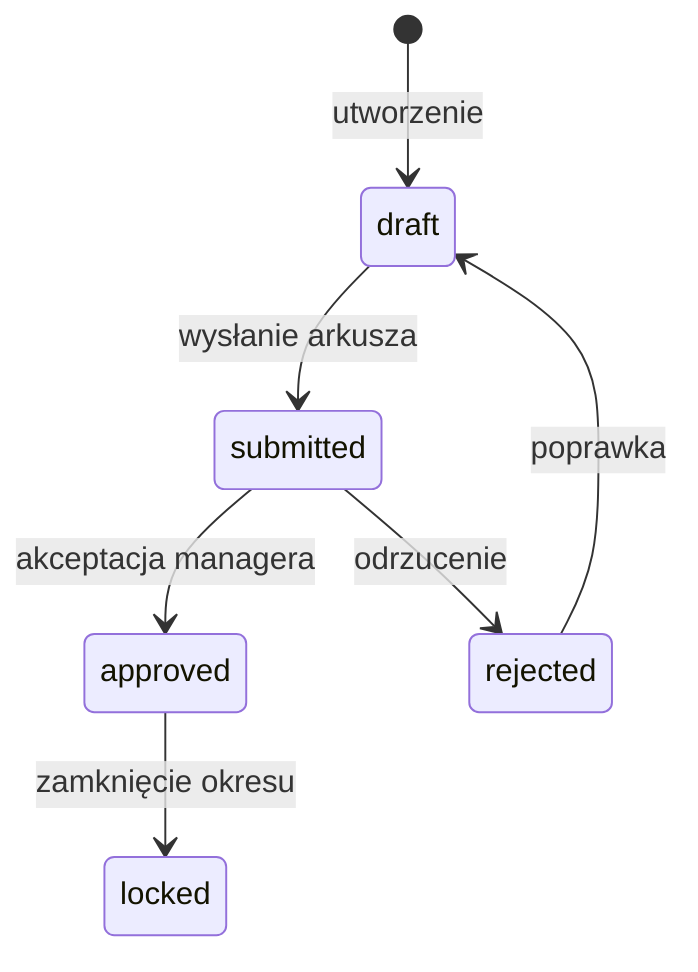
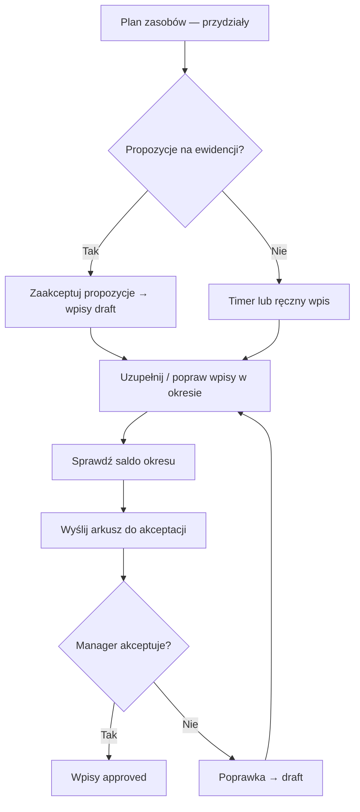

# Czas pracy — dokumentacja funkcji

Moduł **Czas pracy** to centralna ewidencja godzin w Rentgen firmy. Łączy ręczne wpisy, timer, arkusze okresowe, plan zasobów, urlopy i raporty zespołowe w jednym miejscu.

**Adresy w aplikacji:**

| URL | Widok | Dla kogo |
|-----|-------|----------|
| `/moja-praca/czas-pracy` | Ewidencja wpisów, timer, propozycje z planu | Pracownik |
| `/moja-praca/czas-pracy/arkusz` | Arkusz okresowy, macierz zespołu, akceptacja | Pracownik + manager |
| Widok klienta → zakładka **Czas pracy** | Podsumowanie godzin i budżet kontraktu | Manager / zespół projektu |

Powiązane dokumenty: [INSTRUKCJA_PRACOWNIK.md](./INSTRUKCJA_PRACOWNIK.md), [INSTRUKCJA_MANAGER.md](./INSTRUKCJA_MANAGER.md), [STAN_WDROZENIA.md](./STAN_WDROZENIA.md).

---

## 1. Model danych

### Wpis czasu (`time_entries`)

Każdy wpis opisuje **ile** czasu (**duration_minutes**), **kiedy** (**date**, opcjonalnie **start_time** / **end_time**), **nad czym** (kategoria, typ, projekt, opis) i **w jakim stanie** (status).

| Pole | Znaczenie |
|------|-----------|
| `category_id` | Kategoria: Projekt, Serwis, Rozwój, Firma |
| `entry_type_id` | Typ: Praca, Nadgodziny, Urlop, Chorobowe, Delegacja, … |
| `project_id` / `client_id` | Kontekst klienta / projektu |
| `work_item_id` | Powiązanie z zadaniem z **Moja praca** |
| `resource_plan_item_id` | Powiązanie z elementem **Planu zasobów** (wpisy z planu) |
| `leave_request_id` | Powiązanie z wnioskiem urlopowym (sync po akceptacji) |
| `mission_id` | Powiązanie z misją / delegacją (`work_missions`) |
| `process_stage_id` | Etap procesu (snapshot, bez twardego FK) |
| `billable` | Czy wpis podlega rozliczeniu z klientem |
| `cost_rate_snapshot` / `client_rate_snapshot` | Stawki w momencie utworzenia wpisu (PLN/h) |
| `created_from` | Skąd powstał wpis (patrz poniżej) |
| `status` | Stan w workflow (patrz poniżej) |

**Źródło wpisu (`created_from`):**

| Wartość | Opis |
|---------|------|
| `manual` | Użytkownik dodał ręcznie w formularzu |
| `timer` | Powstał po zatrzymaniu timera |
| `plan` | Zaakceptowana propozycja z planu zasobów |
| `leave` | Automatyczny wpis po akceptacji urlopu |
| `mission` | *(zarezerwowane)* |
| `import` | *(zarezerwowane)* |

### Status wpisu



| Status | Znaczenie | Edycja |
|--------|-----------|--------|
| `draft` | Szkic, w trakcie uzupełniania | Tak (właściciel / manager) |
| `submitted` | Wysłany w arkuszu do akceptacji | Nie (poza adminem) |
| `approved` | Zaakceptowany przez managera | Nie (poza adminem) |
| `rejected` | Odrzucony — wymaga poprawki | Tak (po odrzuceniu arkusza wraca do draft) |
| `locked` | Zablokowany (okres zamknięty) | Tylko administrator |

### Arkusz czasu (`timesheets`)

Arkusz grupuje wpisy użytkownika w **okresie** (tydzień lub miesiąc). Ma własny status (`draft` → `submitted` → `approved` / `rejected`) i komentarze pracownika / managera.

### Kategorie i typy (słowniki)

**Kategorie** (`time_categories`) — określają *charakter* pracy:

- **Projekt** — wymaga projektu
- **Serwis** — wymaga projektu lub zgłoszenia serwisowego
- **Rozwój** / **Firma** — praca wewnętrzna

**Typy** (`time_entry_types`) — określają *rodzaj* czasu:

- **Praca**, **Nadgodziny** — liczą się do czasu pracy
- **Urlop**, **Chorobowe** — liczą się jako nieobecność
- **Delegacja**, **Szkolenie**, **Dyżur**, **Odbiór dnia**, **Inne** — reguły walidacji zależą od typu

Konfiguracja słowników: migracja `125_time_tracking.sql`.

---

## 2. Ewidencja wpisów (`/moja-praca/czas-pracy`)

Główny ekran pracownika. Składa się z:

1. **Timer** — start / pauza / stop
2. **Propozycje z planu zasobów** — jeśli są przydziały bez wpisów
3. **Arkusz bieżącego okresu** — status, wysyłka do akceptacji
4. **Saldo okresu** — norma vs przepracowane godziny
5. **Raport okresu** — podsumowanie wg kategorii i typów
6. **Lista wpisów** — edycja, usuwanie, historia zmian

### Ręczne dodawanie wpisu

Przycisk **Dodaj czas** otwiera formularz:

- **Data** i **czas** (format: `2h`, `90m`, `1.5`)
- **Kategoria** i **typ wpisu**
- **Projekt** (wymagany dla kategorii „Projekt” / „Serwis”)
- **Misja / delegacja** — opcjonalnie, jeśli w danym dniu masz aktywną misję w `work_missions`
- **Opis**, flagi: do rozliczenia, praca zdalna, delegacja

Walidacja (`lib/time-tracking/validation.ts`):

- Czas > 0
- Projekt wymagany tam, gdzie kategoria/typ tego wymaga
- Opis wymagany dla typów z `requires_description`
- Przy wpisach z godzinami start/koniec — brak nakładania się zakresów w tym samym dniu

### Edycja i usuwanie

- Wpisy w statusie **draft** / **rejected** — edycja i usuwanie przez właściciela
- Manager / administrator — edycja wpisów zespołu
- Usuwanie wpisów innych niż **draft** — tylko administrator
- **Historia zmian** — log w `time_entry_logs` (kto, kiedy, co zmienił)

---

## 3. Timer

Timer rejestruje czas w czasie rzeczywistym (`active_timers`).

**Przebieg:**

1. **Start** — wybór kategorii, typu, opcjonalnie projektu
2. **Pauza / wznowienie** — zatrzymanie liczenia bez zapisu wpisu
3. **Stop** — dialog z podsumowaniem; po potwierdzeniu powstaje wpis ze `created_from: timer`

**Ostrzeżenia:**

- Długi timer (> 8 h domyślnie) — komunikat w UI
- Po stopie — standardowa walidacja wpisu (nakładanie, wymagane pola)

API: `/api/time-tracking/timer` (GET, start, pause, resume, stop, DELETE anulowanie).

---

## 4. Okres raportowy (tydzień / miesiąc)

Na ewidencji i arkuszu można przełączać **tydzień** lub **miesiąc**. Strzałki przesuwają okres wstecz / do przodu; **Bieżący tydzień/miesiąc** wraca do dzisiaj.

Okres determinuje:

- które wpisy widać na liście
- saldo godzin (norma vs praca)
- propozycje z planu zasobów
- macierz zespołu (na arkuszu)

Logika dat: `lib/time-tracking/timesheet-period.ts` (tydzień = pon–nd, miesiąc = 1.–ostatni dzień).

---

## 5. Saldo godzin (norma vs praca)

Karta **Saldo okresu** porównuje:

| Składnik | Opis |
|----------|------|
| **Norma** | Liczba dni roboczych × dzienny limit godzin (domyślnie 8 h; z profilu: `daily_hours_limit`) |
| **Praca** | Suma minut wpisów typów „praca” (bez urlopów/chorobowego) |
| **Nieobecności** | Urlopy, chorobowe itd. |
| **Saldo** | Praca − norma (nadwyżka / niedobór) |

Dni robocze = pn–pt bez polskich świąt (`lib/time-tracking/work-schedule.ts`, `lib/resource-plan/polish-holidays.ts`).

---

## 6. Arkusz czasu i akceptacja

### Dla pracownika

Panel **Arkusz czasu** na ewidencji:

- Status arkusza (Roboczy / Wysłany / Zaakceptowany / Odrzucony)
- Suma minut w okresie
- Komentarz pracownika
- **Wyślij do akceptacji** — zmienia status wpisów draft/rejected → submitted oraz arkusza → submitted

Przed wysłaniem system sprawdza każdy wpis (`collectTimesheetSubmitIssues`) — brak projektu, pusty opis itd. blokują wysyłkę z listą błędów.

### Dla managera

Na ewidencji (jeśli rola manager/admin): panel **Do akceptacji** — lista arkuszy zespołu w statusie `submitted`. Manager może **zaakceptować** lub **odrzucić** z komentarzem.

Pełny widok arkusza: `/moja-praca/czas-pracy/arkusz` — raport okresu, saldo, tabela dzienna, macierz zespołu.

---

## 7. Arkusz zespołowy (`/moja-praca/czas-pracy/arkusz`)

Widok dla managera (i pracownika — własny arkusz).

### Macierz „Zestawienie dzienne zespołu”

Tabela: **wiersze = pracownicy**, **kolumny = dni okresu**, **komórki = suma godzin**.

**Oznaczenia kalendarza** (jak w planie zasobów):

| Oznaczenie | Wygląd |
|------------|--------|
| Weekend | Szare tło kolumny |
| Święto (PL) | Fioletowe tło |
| Urlop zaakceptowany | Zielony, etykieta „Urlop” |
| Urlop oczekujący | Pomarańczowy przerywany, „Oczek.” |

Legenda pod tabelą. W nagłówku kolumn (widok miesiąca) — numer dnia + skrót dnia tygodnia.

**Rozwijanie wiersza** — rozbicie na projekty; dalsze rozwijanie — lista pojedynczych wpisów z opisem i kategorią.

### Raporty okresowe

- Podsumowanie wg kategorii / typów
- Saldo godzin wybranego pracownika
- Rozbicie projektów pracownika

API macierzy: `GET /api/time-tracking/timesheets/team-detail?dateFrom=&dateTo=&periodType=`.

---

## 8. Propozycje z planu zasobów

Integracja z modułem **Plan zasobów** (`159_time_tracking_plan_link.sql`).

**Jak powstają propozycje:**

1. System pobiera elementy planu nachodzące na wybrany okres
2. Dla każdego elementu, w którym użytkownik jest **odpowiedzialny** lub **uczestnikiem** (% zaangażowania), liczy łączne godziny (`lib/resource-plan/participant-contribution.ts`)
3. Godziny rozkłada **równomiernie na dni robocze** w zakresie dat użytkownika
4. Pomija dni, dla których już istnieje wpis z `resource_plan_item_id`

**Panel na ewidencji** — tabela propozycji (data, przydział, projekt, czas). Akcje:

- **Zaakceptuj zaznaczone**
- **Zaakceptuj wszystkie**

Akceptacja tworzy wpisy **draft** ze `created_from: plan`, powiązane z elementem planu i opcjonalnie z zadaniem `work_items` (jeśli zsynchronizowane).

API:

- `GET /api/time-tracking/plan-suggestions?dateFrom=&dateTo=`
- `POST /api/time-tracking/plan-suggestions/accept`

---

## 9. Integracja z urlopami

Po **akceptacji wniosku urlopowego** (API decyzji urlopu) system automatycznie:

1. Sprawdza typ urlopu (`leave_type` ze słownika)
2. **Delegacje / wyjazdy służbowe** — pomija (nie tworzy wpisów)
3. **Chorobowe** → typ wpisu „Chorobowe”; pozostałe → „Urlop”
4. Dla każdego **dnia roboczego** w zakresie urlopu tworzy wpis:
   - kategoria **Firma**
   - status **approved**
   - `created_from: leave`
   - `leave_request_id` — powiązanie z wnioskiem
   - czas = dzienny limit z profilu (domyślnie 8 h)

Przy **cofnięciu** decyzji urlopu — wpisy powiązane z `leave_request_id` są usuwane.

Migracja: `154_time_tracking_leave_sync.sql`.

### Backfill historyczny (admin)

Jednorazowe uzupełnienie wpisów dla urlopów zaakceptowanych **przed** wdrożeniem syncu:

```http
POST /api/time-tracking/leave-backfill
```

Wymaga roli manager/admin. Przetwarza wszystkie wnioski `approved` bez istniejących wpisów urlopowych.

---

## 10. Budżet godzin projektu

W widoku klienta → zakładka **Czas pracy** (`ProjectTimeTrackingPanel`).

Jeśli w **Rozliczeniach projektu** zdefiniowano pola kontraktu (`project_contract_quotas`) z jednostką **godziny**:

- Karta **Budżet godzin kontraktu** — wykorzystanie vs limit
- Pasek postępu; ostrzeżenie przy przekroczeniu
- Przy wielu polach kontraktu — rozbicie proporcjonalne

Źródło wykorzystania: suma wpisów czasu przypisanych do projektu (statusy inne niż `rejected`).

Konfiguracja budżetu: panel rozliczeń projektu (`project_billing_settings`, `project_contract_quotas` — migracja `158`).

---

## 11. Misje i delegacje

Tabela `work_missions` (migracja `160`) — przypisanie użytkownika do tytułu, zakresu dat, opcjonalnie projektu/klienta.

W formularzu wpisu czasu, dla wybranej daty, lista **aktywnych misji** (status `active`, data w zakresie) pozwala powiązać wpis przez `mission_id`.

API: `GET /api/time-tracking/missions?date=YYYY-MM-DD`.

> **Uwaga:** CRUD misji w UI (tworzenie/edycja) jest w roadmapie — obecnie rekordy dodaje się bezpośrednio w bazie lub przyszły panel.

---

## 12. Snapshot stawek (koszty)

Przy **utworzeniu** wpisu system zapisuje:

| Pole | Źródło |
|------|--------|
| `cost_rate_snapshot` | `profiles.cost_rate` — stawka kosztowa pracownika |
| `client_rate_snapshot` | `project_billing_settings.hourly_rate_net` — gdy w projekcie włączone rozliczenie godzinowe (`hourly_enabled`) |

Stawki są **zamrożone** w wpisie — późniejsza zmiana profilu lub ustawień projektu nie zmienia historycznych wpisów.

Migracja stawki klienta: `161_project_billing_hourly_rate.sql`.

---

## 13. Czas pracy w widoku projektu (klient)

`GET /api/projects/{projectId}/time-entries` zwraca:

- listę wpisów z imieniem pracownika i etapem procesu
- podsumowanie wg etapów procesu
- opcjonalnie **hourBudget** (budżet kontraktu)

Dostęp kontrolowany przez `assertUserCanAccessProjectServer`.

---

## 14. Uprawnienia

| Akcja | Pracownik | Manager / admin |
|-------|-----------|-----------------|
| Własne wpisy — CRUD (draft) | ✅ | ✅ |
| Wpisy innych — podgląd | ❌ | ✅ |
| Wpisy innych — edycja | ❌ | ✅ |
| Macierz zespołu, akceptacja arkuszy | ❌ | ✅ |
| Backfill urlopów | ❌ | ✅ |
| Edycja wpisów approved/locked | ❌ | Tylko admin |

Implementacja: `lib/time-tracking/permissions.ts`.

---

## 15. API — skrót

| Metoda | Endpoint | Opis |
|--------|----------|------|
| GET | `/api/time-tracking/meta` | Kategorie i typy wpisów |
| GET/POST | `/api/time-tracking/entries` | Lista / tworzenie wpisów |
| PATCH/DELETE | `/api/time-tracking/entries/{id}` | Edycja / usuwanie |
| GET | `/api/time-tracking/entries/{id}/logs` | Historia zmian |
| GET | `/api/time-tracking/timer` | Aktywny timer |
| POST | `/api/time-tracking/timer/start` | Start timera |
| POST | `/api/time-tracking/timer/stop` | Stop → wpis |
| GET | `/api/time-tracking/timesheets` | Arkusze okresowe |
| POST | `/api/time-tracking/timesheets/{id}/submit` | Wysyłka do akceptacji |
| POST | `/api/time-tracking/timesheets/{id}/approve` | Akceptacja (manager) |
| POST | `/api/time-tracking/timesheets/{id}/reject` | Odrzucenie (manager) |
| GET | `/api/time-tracking/summary` | Raport okresu + arkusz |
| GET | `/api/time-tracking/timesheets/team-overview` | Lista zespołu w okresie |
| GET | `/api/time-tracking/timesheets/team-detail` | Macierz dzienna zespołu |
| GET | `/api/time-tracking/plan-suggestions` | Propozycje z planu |
| POST | `/api/time-tracking/plan-suggestions/accept` | Akceptacja propozycji |
| GET | `/api/time-tracking/missions` | Misje użytkownika na datę |
| POST | `/api/time-tracking/leave-backfill` | Backfill urlopów (admin) |
| GET | `/api/projects/{id}/time-entries` | Czas pracy projektu |

---

## 16. Warstwy kodu (architektura)

Zgodnie ze wzorcem projektu (store + repository + server):

```
lib/time-tracking/           — logika: okresy, saldo, walidacja, plan, budżet, kalendarz
lib/supabase/
  time-tracking-server.ts    — CRUD wpisów, timer, projekt
  time-tracking-plan-server.ts — propozycje z planu
  time-tracking-leave-sync-server.ts — sync urlopów
  time-sheets-server.ts        — arkusze, macierz zespołu
  time-tracking-repository.ts  — fetch z API (klient)
store/time-tracking-store.ts — cache sesji (Zustand)
components/time-tracking/    — UI
app/api/time-tracking/       — trasy REST
```

**Store** (`useTimeTrackingStore`):

- `ensureMeta`, `ensureEntries`, `ensureTimer`, `ensureCurrentTimesheet`
- `ensurePlanSuggestions`, `acceptPlanSuggestions`
- `ensureTeamPeriodDetail`, `ensureTimesheetSummary`
- `force: true` po mutacji — odświeżenie w tle

---

## 17. Migracje Supabase

| Migracja | Zawartość |
|----------|-----------|
| `125_time_tracking.sql` | Tabele: wpisy, kategorie, typy, timer, logi |
| `154_time_tracking_leave_sync.sql` | `leave_request_id` na wpisach |
| `159_time_tracking_plan_link.sql` | `resource_plan_item_id` na wpisach |
| `160_work_missions.sql` | Tabela `work_missions`, FK `mission_id` |
| `161_project_billing_hourly_rate.sql` | Stawka godzinowa w ustawieniach rozliczeń |

Wymaga wcześniejszych migracji planu zasobów (`101+`), urlopów, rozliczeń projektu (`158`).

---

## 18. Typowy przepływ pracownika



---

## 19. Roadmapa (poza zakresem)

- UI zarządzania misjami (CRUD)
- Wykrywanie anomalii / sugestie AI
- Automatyczne zasilanie `project_hourly_reports` z wpisów czasu
- Realtime odświeżanie macierzy zespołu

Szczegóły statusu: [STAN_WDROZENIA.md](./STAN_WDROZENIA.md).
