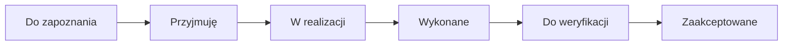

# Instrukcja — pracownik (Moja praca)

Przewodnik dla osoby wykonującej zadania: lista, rytm dnia, przyjmowanie pracy i zgłaszanie problemów.

## Gdzie pracuję

| Miejsce | Adres | Po co |
|---------|-------|-------|
| **Zadania** | Moja praca → **Zadania** (`/moja-praca/zadania`) | Główna lista / Kanban Twoich zleceń |
| **Dostępność** | Moja praca → **Dostępność** | Urlopy i niedostępność (wpływa na planowanie) |

Manager ma dodatkowo **Pulpit** — Ty go nie potrzebujesz do codziennej pracy.

---

## Skąd biorą się zadania

Zadania w **Moja praca** to agregat wielu źródeł. Każde ma etykietę **Źródło** (np. Tablica wdrożeń, Serwis, Ustalenia).

| Źródło | Skąd się bierze |
|--------|-----------------|
| **Zadanie ręczne** | Manager utworzył je w **Nowe zadanie** i wysłał do Ciebie |
| **Tablica wdrożeń** | Karta Kanban z Twoim przypisaniem |
| **Proces / serwis / ustalenia / …** | Element w innym module z przypisanym wykonawcą |

Lista odświeża się automatycznie w tle. Przycisk **Odśwież** wymusza pełną synchronizację ze wszystkimi modułami.

**Ważne:** Anulowane zadania znikają z listy aktywnych. Nie powinny już pojawiać się w planie dnia po odświeżeniu kontekstu dnia.

---

## Widok listy i Kanban

### Lista (domyślna)

Zadania są pogrupowane w sekcje, m.in.:

- **Do zapoznania** — nowe lub wysłane, czekają na Twoją reakcję
- **Dzisiaj / Zaległe / W realizacji** — praca bieżąca
- **Do weryfikacji** — Ty zakończyłeś, manager ma zatwierdzić (jeśli dotyczy)

Kliknij wiersz, aby otworzyć **panel szczegółów** zadania.

### Kanban

Te same zadania w kolumnach statusowych. Przeciąganie zmienia etap tam, gdzie workflow na to pozwala.

### Filtry

Możesz zawęzić listę po projekcie, statusie, **Zaległe**, **Wymagające reakcji** itd. Widzisz **tylko zadania przypisane Tobie** (nie zadania kolegów).

---

## Typowy przebieg zadania

### 1. Przyjęcie zadania

1. Otwórz zadanie z sekcji **Do zapoznania**.
2. Kliknij **Przyjmij zadanie**.
3. Wybierz reakcję:
   - **Przyjmuję** — standardowa akceptacja
   - **Potrzebuję wyjaśnienia** — manager dostaje sygnał
   - **Zgłaszam brak / zagrożenie** — tworzy przeszkodę, manager jest powiadamiany
   - **Nie mogę zrealizować** / **Proponuję zmianę terminu** — eskalacja do managera

### 2. Realizacja

- Status przechodzi w **W realizacji** (lub **Przyjęte**).
- W panelu: komentarze, **Zgłoś przeszkodę**, link **Przejdź do źródła** (oryginalny rekord w module źródłowym).

### 3. Zakończenie

1. **Podsumuj wykonanie**.
2. Wybierz wynik: **Wykonane**, **Częściowo**, **Niewykonane**, **Przełożone**, **Zablokowane**.
3. Po **Wykonane** zadanie trafia do managera (**Do weryfikacji**), jeśli wymaga zatwierdzenia.

### 4. Prośba o przejęcie

Jeśli jesteś osobą wspierającą na zadaniu, możesz użyć **Poproś o przejęcie** — manager lub główny wykonawca dostanie powiadomienie.

---

## Rytm dnia (plan na dziś)

Sekcja **Rytm dnia** na górze strony **Zadania** pomaga zaplanować dzień pracy.

### Rozpoczęcie dnia

1. Kliknij **Rozpoczynam dzień**.
2. System tworzy **plan dnia** z zadań, które dziś wymagają uwagi:
   - termin **dzisiaj**,
   - **zaległe**,
   - **do zapoznania**,
   - **w realizacji**.

### Plan na dziś

- Każda pozycja to klikalne zadanie — otwiera ten sam panel szczegółów co na liście.
- Etykieta **przeniesione** oznacza zadanie przeniesione z poprzedniego dnia (gdy przy zamykaniu dnia zaznaczono przeniesienie niewykonanych).

### Zakończenie dnia

1. **Podsumuj dzień**.
2. Opcjonalnie: **Wygeneruj szkic AI** (wymaga konfiguracji po stronie firmy).
3. Wpisz komentarz, zdecyduj czy **przenieść niewykonane na jutro**.
4. **Zakończ dzień**.

Po zakończeniu dnia nie edytujesz już planu tego dnia — następnego ranka zaczynasz od nowa.

---

## Plan tygodnia (od managera)

Gdy manager wyśle **plan tygodnia**:

### Gdzie to jest

**Moja praca → Zadania** — panel **Plan tygodnia** pod **Rytm dnia** (nie ma osobnej pozycji w menu bocznym).

1. Na stronie **Zadania** pojawi się panel **Plan tygodnia** z datami i listą zadań.
2. Otwórz go i przejrzyj zadania na bieżący tydzień.
3. Opcjonalnie: **Analiza ryzyk AI** — podpowiedź zagrożeń do pola komentarza.
4. **Potwierdź** plan lub dodaj uwagi w polu zagrożeń / komentarza.

Plan tygodnia to uzgodnienie priorytetów — pojedyncze zadania nadal obsługujesz normalnie z listy.

---

## Powiadomienia

Dzwonek w aplikacji informuje m.in. o:

- nowym zadaniu wysłanym do Ciebie,
- przeszkodzie / prośbie o wyjaśnienie od managera,
- zadaniu do weryfikacji (jeśli jesteś managerem na tym zadaniu),
- prośbie o przejęcie.

Kliknięcie w powiadomienie prowadzi do zadania.

---

## Częste pytania

**Dlaczego widzę zadanie z innego modułu?**  
System zbiera pracę przypisaną do Ciebie w jednym miejscu. Szczegóły źródłowe otwierasz przez **Przejdź do źródła**.

**Zadanie zniknęło z listy.**  
Może być anulowane, zakończone, przypisane do kogoś innego lub zsynchronizowane ze źródłem, które zmieniło status. Użyj **Odśwież**.

**Czy mogę anulować zadanie?**  
Nie — anulowanie i edycja treści zadań ręcznych należy do managera (lub admina).

**Czy mogę usunąć zadanie?**  
Nie. Trwałe usunięcie jest tylko dla administratora i tylko szkiców / anulowanych zadań ręcznych.

---

## Szybka ściąga (dzień pracy)

| Krok | Akcja |
|------|-------|
| Rano | **Rozpoczynam dzień** → przejrzyj **Plan na dziś** |
| Nowe zadanie | **Do zapoznania** → **Przyjmij zadanie** |
| W trakcie dnia | Lista / Kanban, **Zgłoś przeszkodę** gdy coś blokuje |
| Problem z terminem | Przy przyjęciu: **Proponuję zmianę terminu** |
| Koniec zadania | **Podsumuj wykonanie** → **Wykonane** |
| Wieczorem | **Podsumuj dzień** → opcjonalnie przenieś resztę na jutro |

Więcej scenariuszy testowych: [TEST_RECZNY.md](./TEST_RECZNY.md).
