# Architektura — Plan Zasobów

> Status: **Etapy 1–4 wdrożone i wypchnięte na `main`** (fundament danych + MVP widoku listy).
> Etapy 5–8 (dashboard, Gantt/kalendarz, sugestie regułowe, AI) — zaprojektowane częściowo
> (walidacje ostrzegawcze już działają), pozostałe do zbudowania. Patrz `STAN_WDROZENIA.md`.

## 1. Cel modułu

Centralne planowanie pracy zespołów i użytkowników: zdolność przyjęcia nowych zleceń, terminy
startu, dostępne zasoby, wymagane kompetencje, ryzyka projektowe, wąskie gardła obciążenia,
terminy klientów. Zasady nadrzędne przyjęte na starcie:

- **Brak osobnego modelu pracownika** — wykorzystujemy istniejące `profiles` (użytkowników systemu).
- **Nic na sztywno** — role, kompetencje, zespoły, obszary, typy pracy, statusy, poziomy ryzyka,
  poziomy kompetencji, typy nieobecności i typy budżetów są konfigurowalne w ustawieniach.
- **Proces i etapy procesu są źródłem prawdy** dla planowania: typ projektu → proces → etapy.
  Etap definiuje wymagane role/kompetencje, min. liczbę osób, szacowany czas/godziny, budżet,
  ryzyko — a moduł Planu Zasobów podsuwa te wartości przy planowaniu.

## 2. Umiejscowienie w aplikacji

Nowy, samodzielny moduł w menu — grupa „Projekty” (`components/app-shell.tsx`), między
„Procesy” i „Projekty”:

```
components/app-shell.tsx
  label: "Projekty"
    /procesy          — Procesy (szablony pipeline)
    /plan-zasobow      — Plan Zasobów              ← NOWE
    /projekty          — Projekty
```

Słowniki modułu mają odrębną stronę ustawień: `/ustawienia/plan-zasobow` (link też z hub-a
`/ustawienia`), analogicznie do `/ustawienia/branze` czy `/ustawienia/specyfikacja`.

## 3. Diagram relacji (ERD)

```mermaid
erDiagram
  resource_dictionary_items ||--o{ user_operational_roles : "role_item_id"
  resource_dictionary_items ||--o{ user_competencies : "competency_item_id / level_item_id"
  resource_dictionary_items ||--o{ user_teams : "team_item_id"
  resource_dictionary_items ||--o{ user_absences : "absence_type_item_id"
  profiles ||--o{ user_operational_roles : "user_id"
  profiles ||--o{ user_competencies : "user_id"
  profiles ||--o{ user_teams : "user_id"
  profiles ||--o{ user_certificates : "user_id"
  profiles ||--o{ user_absences : "user_id"

  process_stages ||--o{ process_stage_role_requirements : "stage_id"
  process_stages ||--o{ process_stage_competency_requirements : "stage_id"
  process_stages ||--o{ process_stage_dependencies : "stage_id / depends_on_stage_id"
  resource_dictionary_items ||--o{ process_stage_role_requirements : "role_item_id"
  resource_dictionary_items ||--o{ process_stage_competency_requirements : "competency_item_id / min_level_item_id"
  resource_dictionary_items ||--o{ process_stages : "default_risk_item_id"

  resource_plan_items ||--o{ resource_plan_item_participants : "plan_item_id"
  projects ||--o{ resource_plan_items : "project_id (optional)"
  clients ||--o{ resource_plan_items : "client_id (optional)"
  profiles ||--o{ resource_plan_items : "assignee_id"
  profiles ||--o{ resource_plan_item_participants : "user_id"
  resource_dictionary_items ||--o{ resource_plan_items : "work_type / team / status / risk item_id"
  process_kanban_tasks ||--o{ resource_plan_items : "task_id (optional)"
  service_intake_requests ||--o{ resource_plan_items : "service_intake_request_id (optional)"
```



## 4. Model danych — 4 migracje (Etapy 1–4)

| Migracja | Zawartość |
|---|---|
| `098_resource_plan_dictionaries.sql` | Generyczna tabela `resource_dictionary_items` (10 słowników w jednej tabeli, dyskryminator `dictionary_key`) + funkcja `has_full_app_access()` + seed demonstracyjny (edytowalny). |
| `099_resource_plan_user_extensions.sql` | `profiles` + `daily_hours_limit`, `weekly_hours_limit`, `base_location`, `cost_rate`, `is_available_for_planning`. Nowe tabele: `user_operational_roles`, `user_competencies`, `user_teams`, `user_certificates`, `user_absences`. |
| `100_resource_plan_process_stage_extensions.sql` | `process_stages` + `min_people_count`, `optimal_people_count`, `estimated_duration_days`, `estimated_labor_hours`, `default_labor_budget`, `default_material_budget`, `default_risk_item_id`, `can_run_in_parallel`, `requires_leader`, `allows_trainee`. Nowe tabele: `process_stage_role_requirements`, `process_stage_competency_requirements`, `process_stage_dependencies`. |
| `101_resource_plan_items.sql` | `resource_plan_items` (element planu) + `resource_plan_item_participants` (dodatkowe osoby zaangażowane). |

### 4.1. `resource_dictionary_items` — jeden mechanizm, 10 słowników

Zamiast 10 osobnych tabel lub JSON blobu w `app_settings` (dotychczasowy wzorzec w aplikacji,
ale bez `color`/`icon`) — jedna tabela z dyskryminatorem `dictionary_key`:

```sql
dictionary_key text check (dictionary_key in (
  'operational_role', 'competency', 'competency_level', 'team', 'area',
  'work_type', 'plan_status', 'risk_level', 'absence_type', 'budget_type'
))
name, description, color, icon, is_active, sort_order, metadata jsonb
unique (dictionary_key, name)
```

Każdy słownik jest w pełni edytowalny w `/ustawienia/plan-zasobow` (nazwa, opis, kolor, ikona,
aktywność, kolejność). Seed w migracji to tylko przykładowe dane startowe, nie logika zakodowana.

### 4.2. Rozszerzenie użytkownika — bez nowego modelu „pracownika”

`profiles` zyskuje pola planistyczne (limity godzin, lokalizacja bazowa, opcjonalna stawka
kosztowa, flaga dostępności do planowania). Role/kompetencje/zespoły to relacje wiele-do-wielu
do `resource_dictionary_items` — użytkownik może mieć wiele ról, wiele kompetencji (z poziomem),
przynależeć do wielu zespołów. Certyfikaty i nieobecności to osobne tabele 1-do-wielu.

### 4.3. Rozszerzenie etapu procesu — źródło prawdy dla planowania

`process_stages` zyskuje pola skalarne (min/optymalna liczba osób, szacowany czas trwania i
roboczogodziny, domyślne budżety robocizny/materiałów, domyślne ryzyko, flagi równoległości/
lidera/ucznia) oraz trzy tabele wielo-wartościowe: wymagane role (z min. liczbą osób), wymagane
kompetencje (z min. poziomem), zależności między etapami tego samego szablonu.

> **Ważne:** `project_processes.template_snapshot` (JSONB) przechowuje zamrożoną kopię
> szablonu procesu w momencie utworzenia projektu. Edycja żywego szablonu (`process_stages`)
> **nie propaguje się** do już utworzonych projektów. Dlatego `resource_plan_items.process_stage_id`
> **nie ma twardego FK** do `process_stages` — analogicznie do istniejącego wzorca
> `project_process_items.template_item_id` (migracja 017). Integralność sprawdzana na poziomie
> aplikacji, nie bazy.

### 4.4. `resource_plan_items` — element planu

Pola: projekt, klient, etap procesu (bez FK — patrz wyżej), opcjonalne powiązanie z zadaniem
Kanban (`task_id`) lub zgłoszeniem serwisowym (`service_intake_request_id`), typ pracy, tytuł,
zakres dat (`start_at`/`end_at`, `check (end_at >= start_at)`), godziny planowane/rzeczywiste,
osoba odpowiedzialna (`assignee_id`), zespół, status, ryzyko (+ notatka), trzy typy budżetu
(robocizna/materiały/dojazd), notatki, flaga `accepted_risk` (świadoma akceptacja ostrzeżenia
przez koordynatora — Etap 5, patrz `lib/resource-plan/validations.ts`). Dodatkowe osoby
zaangażowane (poza `assignee_id`) w `resource_plan_item_participants`, z opcjonalną rolą i flagą
lidera.

### 4.5. RLS

Wzorzec spójny z resztą modułu: `select` dla każdego zalogowanego (`auth.uid() is not null`),
`insert/update/delete` dla `has_full_app_access()` — nowa funkcja SQL (administrator **lub**
manager = „koordynator”), zdefiniowana w `098_resource_plan_dictionaries.sql`.

## 5. Warstwy kodu (repository → store → UI)

| Warstwa | Plik | Rola |
|---|---|---|
| Typy słowników | `lib/resource-plan/dictionary-types.ts` | `DICTIONARY_KEYS`, etykiety/opisy PL, `DictionaryItem(Input)` |
| Ikony | `lib/resource-plan/icon-options.ts` | katalog ikon lucide-react + `resolveDictionaryIcon(name)` |
| Repo słowników | `lib/supabase/dictionary-repository.ts` | CRUD `resource_dictionary_items` + reorder |
| Store słowników | `store/dictionary-store.ts` | `ensure()`, `byKey(key)`, `itemLabel(id)`, CRUD z aktualizacją cache |
| Typy profilu zasobowego | `lib/resource-plan/user-resource-types.ts` | `UserCompetency`, `UserTeamMembership`, `UserCertificate(Input)`, `UserAbsence(Input)`, `UserResourceProfile` |
| Repo profilu zasobowego | `lib/supabase/user-resource-repository.ts` | CRUD ról/kompetencji/zespołów/certyfikatów/nieobecności + `fetchUserResourceProfilesBatch` (bez N+1) |
| Store profilu zasobowego | `store/user-resource-store.ts` | cache per `userId`, mutacje aktualizują cache |
| Typy wymagań etapu | `lib/process/types.ts` (rozszerzenie `ProcessStage`) | pola skalarne + `requiredRoles`, `requiredCompetencies`, `dependsOnStageIds` |
| Mapowanie etapu | `lib/supabase/process-mappers.ts`, `lib/process/anchored-template.ts` | `rowToProcessStage` (z DB) i `parseProcessTemplateSnapshot` (z JSONB snapshotu) — obie ścieżki muszą dawać te same domyślne wartości |
| Repo szablonów | `lib/supabase/process-repository.ts` | `fetchTemplatesGraph` (batch fetch wymagań po etapach), `insertTemplateStagesGraph` (2-fazowy insert: najpierw etapy, potem wymagania/zależności — unika FK na etapy „w przyszłości") |
| Typy elementu planu | `lib/resource-plan/types.ts` | `ResourcePlanItem(Input)`, `ResourcePlanParticipant`, `ResourcePlanFilters` |
| Repo planu | `lib/supabase/resource-plan-repository.ts` | CRUD `resource_plan_items` + uczestnicy, `fetchResourcePlanItemsInRange`, `fetchResourcePlanItemsForProject` |
| Store planu | `store/resource-plan-store.ts` | `ensureRange(from, to)` (cache po zakresie dat), `createItem`/`updateItem`/`removeItem`, `allItems()` |
| Walidacje | `lib/resource-plan/validations.ts` | `validateResourcePlanItem()` — **ostrzeżenia, nie blokady** (patrz §6) |
| UI ustawień | `components/settings/dictionary-settings-page.tsx` + `app/ustawienia/plan-zasobow/page.tsx` | generyczny edytor wszystkich 10 słowników (zakładki, sortowanie strzałkami — wzorem `field-options-editor.tsx`) |
| UI admina | `components/admin/user-resource-profile-editor.tsx` (w `user-admin-panel.tsx`) | edycja ról/kompetencji/zespołów/certyfikatów/nieobecności użytkownika |
| UI szablonu procesu | `components/process/process-stage-resource-panel.tsx` (w `process-template-editor.tsx`) | edycja wymagań zasobowych etapu |
| UI planu | `components/resource-plan/resource-plan-list.tsx` + `resource-plan-side-panel.tsx` | widok listy + panel boczny tworzenia/edycji z ostrzeżeniami |
| Logika drag/resize Gantta | `lib/resource-plan/gantt-drag.ts` | przeliczanie pikseli↔dni, snapowanie, przydział „torów” dla nakładających się elementów (`assignGanttLanes`), wykrywanie wiersza pod kursorem (`resolveGanttRowId`), zakres dat/etykieta/szerokość kolumny per poziom zoomu (`getGanttPeriodRange`, `formatGanttPeriodLabel`, `GANTT_ZOOM_DAY_WIDTH_PX`, `GANTT_ZOOM_SNAP_DAYS`), grupowanie dni po miesiącu do nagłówka (`groupGanttDaysByMonth`) |
| Polskie święta | `lib/resource-plan/polish-holidays.ts` | wyszarzenie dni ustawowo wolnych w Gantcie (algorytm liczony lokalnie, bez zależności zewnętrznej) |
| Szablony elementu planu | `lib/resource-plan/plan-item-template.ts` | typ i (de)serializacja `metadata` pozycji słownika `plan_item_template` (typ pracy, godziny, budżety, ryzyko, notatki) |
| UI Gantta | `components/resource-plan/resource-plan-gantt.tsx` | widok Gantt (domyślny w `/plan-zasobow`) — przeciąganie/rozciąganie elementów na osi czasu i między wierszami, grupowanie wierszy (osoby/zespoły/projekty), zoom miesiąc/kwartał/rok, szybkie dodawanie z szablonu, responsywny pasek narzędzi (mobile-first) |

## 6. Model walidacji — ostrzeżenia, nie blokady (Etap 5)

`validateResourcePlanItem()` (`lib/resource-plan/validations.ts`) zwraca listę
`{ code, message, severity: "warning" | "danger" }`, **nigdy nie blokuje zapisu**. Sprawdzane
warunki: konflikt terminów osoby/zespołu, przekroczenie dziennego/tygodniowego limitu godzin,
brak wymaganej roli/kompetencji/lidera (z definicji etapu), brak przypisanej osoby, nachodzenie
na zgłoszoną nieobecność, brak budżetu (gdy etap ma zdefiniowany budżet domyślny), wysokie
ryzyko (najwyższy `sort_order` w słowniku `risk_level`). Panel boczny (`resource-plan-side-panel.tsx`)
prezentuje ostrzeżenia i wymaga zaznaczenia `accepted_risk`, by zapisać element z aktywnymi
ostrzeżeniami — koordynator może **świadomie** przejść dalej.

## 7. Decyzje architektoniczne

| # | Temat | Decyzja |
|---|---|---|
| D1 | Model pracownika | Brak nowej tabeli — wyłącznie `profiles` + relacje wiele-do-wielu do słowników. |
| D2 | Słowniki | Jedna generyczna tabela `resource_dictionary_items` z `dictionary_key`, nie 10 tabel i nie JSON w `app_settings` (brak `color`/`icon` w tym wzorcu). |
| D3 | `process_stage_id` na elemencie planu | Bez twardego FK — etapy żyją w zamrożonym `template_snapshot` projektu, mogą zniknąć z żywego `process_stages` po edycji szablonu. |
| D4 | RLS | Odczyt: każdy zalogowany. Zapis: `has_full_app_access()` (administrator/manager) — wzorem reszty modułów konfiguracyjnych. |
| D5 | Walidacje | Wyłącznie ostrzeżenia (`warning`/`danger`), nigdy hard block — koordynator zachowuje pełną decyzyjność, z jawną akceptacją (`accepted_risk`). |
| D6 | Wstawianie wymagań etapu | Dwufazowe (najpierw wszystkie etapy, potem wymagania/zależności) — unika FK violation przy zależnościach „w przód” w tym samym szablonie. |
| D7 | UI edytora słowników | Wzorzec `field-options-editor.tsx` (karty, sortowanie strzałkami), nie drag&drop — zgodnie z resztą aplikacji (brak biblioteki DnD poza natywnym HTML5 w Kanbanie). |
| D8 | Panel boczny | Radix `Dialog` w wariancie fullscreen (wzorem `process-item-panel.tsx`), nie dedykowany Drawer/Sheet — taki komponent nie istnieje w aplikacji. |
| D9 | Mechanizm drag w Gantcie | Pointer Events (`onPointerDown/Move/Up` + `setPointerCapture`) z pozycjonowaniem absolutnym w pikselach, nie natywny HTML5 Drag&Drop — HTML5 DnD nie daje płynnej, ciągłej informacji o pozycji podczas przeciągania (potrzebnej do dowolnego przesuwania/rozciągania na osi czasu), a Pointer Events już są używane w aplikacji do dotykowego przeciągania w Kanbanie (`kanban-task-card.tsx`). |
| D10 | ~~Zakres przeciągania w Gantcie~~ (zmienione, patrz D12) | ~~Przeciąganie zmienia tylko `startAt`/`endAt`~~ — rozszerzone na życzenie o przeciąganie między wierszami. |
| D11 | Snapowanie i grupowanie Gantta | Snapowanie do pełnych dni (w widoku miesięcznym), domyślne grupowanie wierszy po osobach z przełącznikiem na zespoły/projekty — decyzje produktowe potwierdzone z właścicielem przed implementacją. Zoom tydzień→kwartał→rok dodany później, patrz D15. |
| D12 | Przeciąganie między wierszami | Wykrywanie wiersza pod kursorem przez `document.elementFromPoint` z tymczasowym `pointer-events: none` na przeciąganym bloku (żeby hit-test nie trafił w sam blok, który wizualnie „jedzie” z kursorem przez `transform: translateY`, a DOM-owo pozostaje w swoim oryginalnym wierszu — pozycjonowanie CSS bez portalu, bo żaden wiersz nie ma `overflow: hidden`). Zmiana wiersza = zmiana pola zależnego od aktualnego grupowania (assigneeId/teamItemId/projectId); zmiana projektu dodatkowo resetuje `processStageId` i przelicza `clientId`. |
| D13 | Szablony elementu planu | Przechowywane jako pozycje istniejącego generycznego słownika (`dictionary_key = 'plan_item_template'`), nie nowa tabela — rozszerzone pola (typ pracy, godziny, budżety, ryzyko, notatki) w już istniejącej kolumnie `metadata` (jsonb). Wybrane, bo backend (repozytorium, store, CRUD, RLS) jest już w 100% generyczny i gotowy; jedyny koszt to niestandardowy formularz w ustawieniach dla tego jednego klucza słownika. |
| D14 | Polskie święta w Gantcie | Wyliczane lokalnie (`lib/resource-plan/polish-holidays.ts`, algorytm Meeusa/Jonesa/Butchera dla Wielkanocy), nie z zewnętrznego API/biblioteki — święta ustawowe w Polsce zmieniają się rzadko i są w pełni wyznaczalne algorytmicznie, więc nie wymagają zależności sieciowej ani utrzymania tabeli dat. |
| D15 | Zoom Gantta (miesiąc/kwartał/rok) | Jedna spójna jednostka pozycjonowania — dzień — dla wszystkich poziomów zoomu; zmienia się tylko szerokość kolumny dnia (`GANTT_ZOOM_DAY_WIDTH_PX`: 40/14/5px) i granulacja snapowania przy przeciąganiu (`GANTT_ZOOM_SNAP_DAYS`: 1/7/30 dni) — unika duplikacji logiki pozycjonowania/drag dla każdego poziomu. Nagłówek w widoku miesięcznym pokazuje numery dni; w kwartale/roku dni są za wąskie na etykiety, więc nagłówek grupuje kolumny po miesiącu (`groupGanttDaysByMonth`). Zmiana zoomu resetuje przesunięcie okresu do „bieżącego”, żeby uniknąć nawigowania po nieintuicyjnych przesunięciach (np. „+3” miesiąca vs „+3” kwartału). |
| D16 | Responsywność mobilna (Plan Zasobów) | Pasek narzędzi Gantta/Listy: `flex-col` na mobile → `sm:flex-row` od ~640px (zamiast jednego nieskładającego się rzędu, który wymuszał obrót telefonu do poziomu); przyciski nawigacji miesiąca/okresu chowają etykietę tekstową na mobile (`hidden sm:inline`), zostaje tylko ikona chevron — analogicznie w panelu bocznym (wiersz wyboru szablonu). Sama tabela Gantta pozostaje przewijana w poziomie na każdej szerokości (`overflow-x-auto`) — to zamierzony, standardowy wzorzec dla wykresów Gantta (linia czasu z natury wymaga szerokości), a nie błąd responsywności. |

## 8. Co dalej

Patrz `STAN_WDROZENIA.md` — szczegółowy status Etapów 1–8 i rekomendowana kolejność dalszych prac
(dashboard modułu, widok Gantt/RTM i kalendarza, sugestie regułowe, przygotowanie pod AI).
