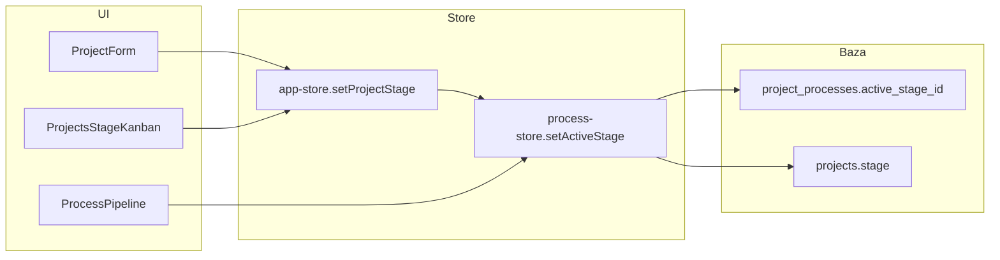

# Architektura — Moduł Projekty

## 1. Dwa powiązane pojęcia „etapu”

W aplikacji historycznie istniały dwa niezależne systemy etapów. Od wdrożenia synchronizacji
obowiązuje jeden kierunek prawdy:

| Pojęcie | Źródło prawdy | Opis |
|---------|---------------|------|
| **Etap projektu** | `projects.stage` (text) | Etykieta wyświetlana w liście, Kanbanie, raportach — **zsynchronizowana** z aktywnym etapem procesu |
| **Aktywny etap procesu** | `project_processes.active_stage_id` (text, UUID etapu w snapshot) | Ręcznie ustawiany marker w pipeline; steruje widokiem klienta, ostrzeżeniami bramki etapów, AI celów |

**Źródło prawdy operacyjne:** `active_stage_id`. Kolumna `projects.stage` przechowuje **tytuł**
aktywnego etapu (denormalizacja dla szybkich list i raportów).

### Diagram synchronizacji

## 2. Model danych

### Tabela `projects`

Główny rekord operacyjny projektu. Kluczowe pola:

| Pole | Typ | Opis |
|------|-----|------|
| `type` | text | Typ projektu — determinuje szablon procesu |
| `flow_status` | text | Status przepływu (W trakcie / Oczekujące / Zamknięty) — z Ustawień |
| `stage` | text | **Tytuł aktywnego etapu procesu** (sync z `active_stage_id`) |
| `is_active` | boolean | Checkbox „Aktywny” — czy zespół teraz pracuje nad projektem |
| `priority` | text | Priorytet operacyjny |
| `blocker_reason` | text | Powód blokady (wymagany przy Oczekujących / nieaktywnym) |
| `close_blocker`, `remaining_hours`, `next_action`, `close_deadline` | — | Pola modułu „Do zamknięcia” |

### Tabela `project_processes`

Jeden proces na projekt (`project_id` UNIQUE):

| Pole | Typ | Opis |
|------|-----|------|
| `template_id` | uuid | Szablon procesu dla typu projektu |
| `template_snapshot` | jsonb | Zamrożona kopia szablonu (etapy, kamienie, elementy) |
| `active_stage_id` | text | ID etapu w snapshot — **aktywny etap** |
| `completions` | jsonb | Ukończone elementy checklisty |
| `milestone_dates` | jsonb | Daty kamieni milowych |

### Tabela `process_stages`

Etapy **szablonu** procesu (per typ projektu):

| Pole | Opis |
|------|------|
| `title` | Nazwa etapu (używana w UI projektu i Kanbanie) |
| `position` | Kolejność w pipeline |
| `for_closing` | Flaga **„Etap zamykający projekt”** (dawniej globalna „Do zamknięcia” w Ustawieniach) |
| `description` | Opis dla AI (cele, asystent) |

Migracja: `supabase/migrations/112_process_stage_for_closing.sql`.

## 3. Przepływy zapisu

### Tworzenie projektu (`app-store.addProject`)

1. `createProject` — insert do `projects` (w tym wstępny `stage` z formularza).
2. `ensureProjectProcess` — tworzy `project_processes` + snapshot szablonu dla `project.type`.
3. `setActiveStage` — ustawia `active_stage_id` na etap o tym samym tytule co wybrany w formularzu.
4. `setActiveStage` synchronizuje `projects.stage` z tytułem aktywnego etapu.

### Zmiana etapu z formularza lub Kanbanu (`app-store.setProjectStage`)

1. `ensureProjectProcess` — proces musi istnieć.
2. `findStageByTitle` — szuka etapu po nazwie w **zakotwiczonym** snapshot projektu.
3. `setActiveStage(stageId)` — zapis `active_stage_id` + sync `projects.stage`.

Drop na Kanbanie jest dozwolony **tylko**, gdy docelowy projekt ma etap o tej nazwie w swoim
procesie (inaczej kolumna pochodzi z innego typu projektu).

### Zmiana z pipeline procesu (`process-store.setActiveStage`)

Wywoływane z `ProcessPipeline` („Oznacz jako aktywny etap”). Po zapisie `active_stage_id`
aktualizuje `projects.stage` przez `updateProjectStage` i patch cache w `app-store`.

**Wyczyszczenie aktywnego etapu** (`active_stage_id = null`) nie nadpisuje `projects.stage`
(kolumna `NOT NULL` — zostaje ostatnia wartość).

### Edycja pełnego projektu (`app-store.updateProject`)

Jeśli `stage` w payloadzie różni się od poprzedniego, po `updateProjectRecord` wołane jest
`setProjectStage` — synchronizacja z procesem.

## 4. Warstwy kodu

| Warstwa | Pliki | Rola |
|---------|-------|------|
| Helpery domenowe | `lib/process/stage-helpers.ts` | `findStageByTitle`, `resolveActiveProcessStage`, `mergeProcessStageTitles`, `buildProjectClosingFlagsMap` |
| Reguły widoków | `lib/project-rules.ts`, `lib/projects-view-filters.ts` | Filtry kategorii, „Do zamknięcia” |
| Repozytorium | `lib/supabase/repository.ts` | CRUD projektów, `updateProjectStage` |
| Repozytorium procesu | `lib/supabase/process-repository.ts` | `getOrCreateProjectProcess`, `updateProjectProcessActiveStage` |
| Store projektów | `store/app-store.ts` | Cache projektów, `setProjectStage`, `addProject` |
| Store procesów | `store/process-store.ts` | Cache procesów, `setActiveStage`, `ensureProjectProcess` |
| Hydrator | `components/data-provider.tsx` | Start app — projekty + `ProcessHydrator` |

Wzorzec cache: komponenty czytają ze store (`ensure` / `hydrate`), nie fetchują w `useEffect`.

## 5. Widok „Do zamknięcia”

Projekt trafia do widoku / filtra **Do zamknięcia**, gdy:

1. Status przepływu ma flagę **W trakcie** lub **Oczekujące** (Ustawienia → statusy przepływu).
2. **Aktywny etap procesu** ma `forClosing: true` w snapshot (ustawiane w edytorze szablonu procesu).

Implementacja: `buildProjectClosingFlagsMap` w `lib/process/stage-helpers.ts` — mapa
`projectId → boolean` budowana z `projectProcesses` + `templates` + `fieldOptions`.

**Uwaga:** Istniejące projekty z zamrożonym snapshotem dostaną flagę `forClosing` na etapach
dopiero po synchronizacji procesu z aktualnym szablonem (`syncProjectProcessFromTemplate`).

## 6. Konfiguracja (co gdzie ustawiać)

| Co | Gdzie |
|----|-------|
| Typy projektów, statusy przepływu, powody blokady | `/ustawienia` |
| **Etapy projektu** (nazwy, kolejność, flaga zamykająca) | `/procesy` → edytor szablonu procesu |
| Aktywny etap na projekcie | Formularz projektu, Kanban projektów, pipeline procesu |

Globalna lista `implementationStages` w `app_settings` została **wycofana** — stary klucz w JSON
może pozostać w bazie, ale aplikacja go nie czyta.

## 7. Kanban projektów vs Tablice wdrożeń

To **dwa różne** moduły Kanban:

| | Kanban projektów | Tablice wdrożeń |
|--|------------------|------------------|
| Trasa | `/projekty` (przełącznik widoku) | `/tablice-wdrozen` |
| Kolumny | Etapy procesu (scalane po nazwie między typami) | Własne kolumny elementu Kanban w szablonie |
| Karty | Projekty | Zgłoszenia (taski) |
| Zmiana kolumny | Zmiana aktywnego etapu procesu | Przesunięcie zadania (`column_id`) |
