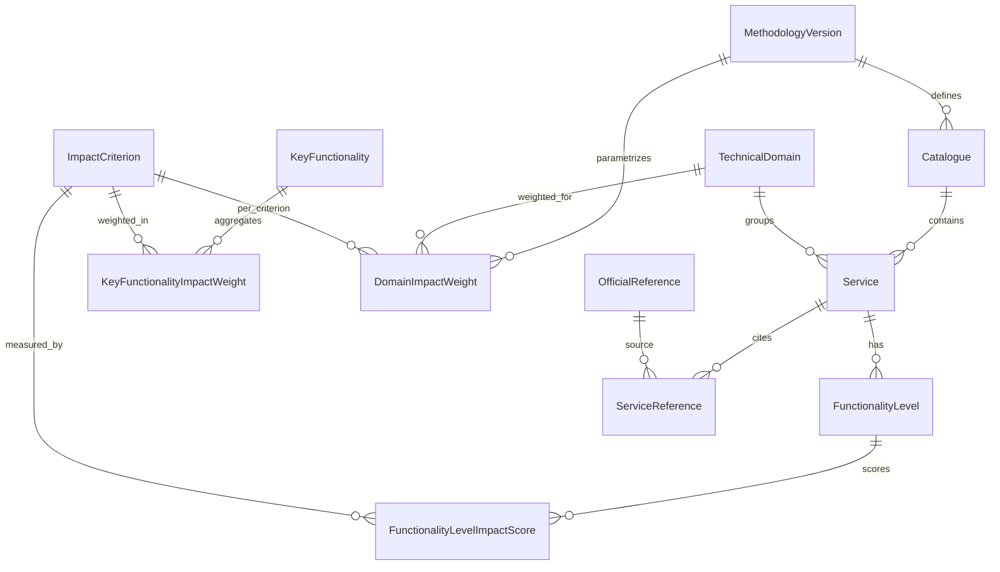
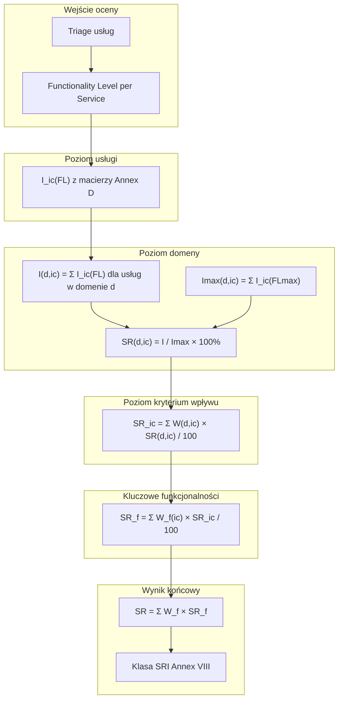

# SRI — architektura silnika wiedzy

## 1. Cel i zakres

Silnik wiedzy SRI w Rentgen przechowuje **wersjonowaną metodologię UE** i umożliwia późniejszą ocenę budynków bez wiązania z konkretnym UI. Na tym etapie implementujemy wyłącznie:

- definicje encji i relacji,
- katalog referencyjny (Method B, 54 usługi),
- opis algorytmu punktacji z Reg. 2020/2155 Annex I.

---

## 2. Źródła normatywne (skrót)

| Warstwa | Dokument | Zawartość |
|---------|----------|-----------|
| Prawo | EPBD 2024/1275 Art. 15, Annex IV | Obowiązkowość od 2027 dla dużych budynków nierezydencjonalnych |
| Metodologia | Reg. delegowane 2020/2155 Annex I–IX | Wzory, domeny, kryteria, wagi, klasy |
| Katalog techniczny | Raport DG ENER 2020, **Annex D** | 54 usługi, poziomy funkcjonalności, macierze impact 0–3 |
| Wdrożenie | Reg. wykonawcze 2020/2156 | Testy krajowe, eksperci, certyfikaty |

---

## 3. Model koncepcyjny — encje

### 3.1 Rdzeń metodologii (statyczna baza wiedzy)

```
MethodologyVersion
├── Catalogue (Method A | Method B | national)
│     ├── TechnicalDomain (9)
│     │     └── Service (1..n)
│     │           ├── FunctionalityLevel (0..4, zależnie od usługi)
│     │           │     └── FunctionalityLevelImpactScore → ImpactCriterion
│     │           ├── ServiceReference (odnośniki prawne/techniczne)
│     │           ├── ServiceDeviceHint (urządzenia typowe)
│     │           └── ServiceApplicabilityRule (triage)
│     ├── ImpactCriterion (7)
│     ├── KeyFunctionality (3 — EPBD Annex IA)
│     │     └── KeyFunctionalityImpactWeight (Annex III)
│     └── DomainImpactWeight (Annex V — per ic × building profile)
├── SRIClassBand (7 klas, Annex VIII)
└── OfficialReference (ELI, annex, artykuł)
```

### 3.2 Warstwa oceny budynku (przyszła — poza tym etapem)

```
BuildingAssessment
├── TriageResult (applicable / excluded / smart_possible)
├── ServiceAssessment (service_id, assessed_fl)
└── CalculatedScore (SR, SRic, SRf, SRd,ic)
```

---

## 4. Encje szczegółowo

### 4.1 `MethodologyVersion`

| Pole | Typ | Opis |
|------|-----|------|
| `id` | UUID | |
| `code` | string | np. `eu-2020-2155-v1` |
| `legal_basis` | text | ELI dyrektywy + rozporządzenia |
| `effective_from` | date | |
| `supersedes_id` | UUID? | Łańcuch wersji |
| `status` | enum | `draft`, `active`, `deprecated` |

**Rozszerzalność:** nowa wersja metodologii (np. delegated act 2027) = nowy rekord + opcjonalna migracja mapowań usług.

### 4.2 `Catalogue`

| Pole | Typ | Opis |
|------|-----|------|
| `id` | UUID | |
| `methodology_version_id` | FK | |
| `code` | string | `eu-method-b-2020`, `eu-method-a-2020`, `pl-national-2028` |
| `method` | enum | `A`, `B`, `national` |
| `locale` | string | `en`, `pl` |
| `service_count` | int | 27 / 54 / custom |

Reg. 2020/2155 **Annex VI**: państwa członkowskie publikują co najmniej jeden katalog; Rentgen traktuje katalog UE jako **domyślny szablon**.

### 4.3 `TechnicalDomain` (Domain)

| Pole | Typ | Opis |
|------|-----|------|
| `id` | UUID | |
| `catalogue_id` | FK | opcjonalnie, jeśli domeny stałe między katalogami |
| `code` | string | `heating`, `cooling`, … |
| `sort_order` | int | |
| `official_name` | i18n jsonb | |
| `description` | i18n jsonb | |
| `source_document` | text | |

**9 domen** — Annex IV Reg. 2020/2155 (patrz `catalogue/domains.json`).

### 4.4 `Service`

| Pole | Typ | Opis |
|------|-----|------|
| `id` | UUID | |
| `domain_id` | FK | |
| `code` | string | np. `H-01` |
| `sort_order` | int | |
| `official_name` | i18n jsonb | Nazwa z Annex D |
| `description` | i18n jsonb | Opis usługi |
| `purpose` | i18n jsonb | Cel |
| `when_applicable` | i18n jsonb | Kiedy oceniać (triage) |
| `typical_devices` | text[] | Wskazówki sprzętowe (technologicznie neutralne) |
| `source_document` | text | Annex D / EN ISO 52120-1 |
| `included_in_method_a` | bool | |
| `applicability_mode` | enum | `smart_ready`, `smart_possible` |
| `mutual_exclusion_group` | string? | Grupa usług wykluczających się |
| `standards_basis` | text[] | |

### 4.5 `FunctionalityLevel`

| Pole | Typ | Opis |
|------|-----|------|
| `id` | UUID | |
| `service_id` | FK | |
| `level_number` | int | 0–4 (ordinal, nie porównywalny między usługami) |
| `official_description` | i18n jsonb | Opis z katalogu UE |
| `practical_description` | i18n jsonb | Wytyczne dla audytora (krajowe/rozszerzone) |

**Przykład (usługa H-01, Heat emission control):**

| FL | Opis oficjalny (skrót) |
|----|------------------------|
| 0 | Brak automatycznego sterowania |
| 1 | Centralne automatyczne sterowanie |
| 2 | Indywidualne sterowanie pomieszczeń |
| 3 | Indywidualne + komunikacja między regulatorami i BACS |
| 4 | Indywidualne + komunikacja + detekcja obecności |

### 4.6 `ImpactCriterion`

| Pole | Typ | Opis |
|------|-----|------|
| `id` | UUID | |
| `code` | string | 7 kodów — Annex II |
| `official_name` | i18n jsonb | |
| `description` | i18n jsonb | |
| `key_functionality_code` | FK logic | Mapowanie Annex III |

Patrz `catalogue/impact-criteria.json`.

### 4.7 `FunctionalityLevelImpactScore` (ServiceImpact)

Zamiast płaskiej tabeli `ServiceImpact(service_id, impact_id, score)` — score jest **zależny od poziomu funkcjonalności**:

| Pole | Typ | Opis |
|------|-----|------|
| `functionality_level_id` | FK | |
| `impact_criterion_id` | FK | |
| `score` | int | 0–3 (skala porządkowa; dopuszczalne wartości ujemne w metodologii) |

To jest macierz z **Annex D Excel** (do importu w kolejnym kroku).

### 4.8 `KeyFunctionality`

Trzy funkcjonalności EPBD (Annex IA Directive 2010/31/EU, powtórzone w 2024/1275 Annex IV):

| Code | EN | PL |
|------|----|----|
| `energy_performance_and_operation` | Energy performance and operation | Efektywność energetyczna i eksploatacja |
| `response_to_occupant_needs` | Response to the needs of the occupants | Reakcja na potrzeby użytkowników |
| `energy_flexibility` | Energy flexibility (incl. demand response) | Elastyczność energetyczna |

### 4.9 `DomainImpactWeight` (Annex V)

| Pole | Typ | Opis |
|------|-----|------|
| `methodology_version_id` | FK | |
| `impact_criterion_id` | FK | |
| `domain_id` | FK | |
| `building_type` | enum | residential / non_residential |
| `climate_zone` | string | Strefa MS (np. PL-N, PL-S) |
| `weight_percent` | decimal | Suma per `impact_criterion` = 100% |

Typy wag: **energy balance** (ogrzewanie, chłodzenie, …), **fixed**, **equal** (monitoring, envelope).

### 4.10 `KeyFunctionalityImpactWeight` (Annex III)

Wagi kryteriów wpływu w ramach każdej z 3 funkcjonalności — definiowane przez **państwo członkowskie**; Rentgen przechowuje profile domyślne (EU study) i nadpisania krajowe.

### 4.11 `OfficialReference`

| Pole | Typ | Opis |
|------|-----|------|
| `id` | UUID | |
| `document_eli` | string | np. `32020R2155` |
| `annex` | string | `I`, `IV`, … |
| `article` | string? | |
| `page` | string? | |
| `paragraph` | string? | |
| `url` | string | EUR-Lex |
| `note` | text | |

Powiązanie M:N z Domain, Service, ImpactCriterion.

### 4.12 `SRIClassBand` (Annex VIII)

| Class | Score range (%) |
|-------|-----------------|
| 1 (highest) | 90–100 |
| 2 | 80–&lt;90 |
| 3 | 65–&lt;80 |
| 4 | 50–&lt;65 |
| 5 | 35–&lt;50 |
| 6 | 20–&lt;35 |
| 7 (lowest) | &lt;20 |

---

## 5. Diagram relacji (ER)



---

## 6. Diagram zależności obliczeń



---

## 7. Sposób wyliczania punktów

Algorytm z **Annex I, Reg. (EU) 2020/2155** (symbolika zachowana).

### Krok 1 — Ocena usług

Dla każdej **istotnej** usługi `Si,d` w domenie technicznej `d` określ `FL(Si,d)` (0–4).  
Z katalogu odczytaj `I_ic(FL(Si,d))` — wkład usługi w kryterium wpływu `ic`.

### Krok 2 — Wynik domeny dla kryterium

```
I(d,ic) = Σ I_ic( FL(Si,d) )   dla i = 1..Nd
Imax(d,ic) = Σ I_ic( FLmax(Si,d) )
SR(d,ic) = I(d,ic) / Imax(d,ic) × 100%
```

`Nd` — liczba **istotnych** usług w domenie po triage (Annex VII).

### Krok 3 — Wynik kryterium wpływu

```
SR_ic = Σ_d [ W(d,ic) × SR(d,ic) / 100 ]   dla d = 1..9
```

`W(d,ic)` — waga domeny dla kryterium (Annex V); Σ_d W = 100% per ic.

### Krok 4 — Wynik kluczowej funkcjonalności

```
SR_f = Σ_ic [ W_f(ic) × SR_ic / 100 ]
```

Mapowanie ic → f według Annex III.

### Krok 5 — Całkowity SRI

```
SR = Σ_f [ W_f × SR_f ]   gdzie Σ_f W_f = 1
```

### Krok 6 — Klasa

Mapowanie `SR` na 7 klas (Annex VIII).

### Triage i normalizacja (Annex VII)

- Usługi **smart_ready** — oceniane tylko gdy TBS istnieje; brak kary jeśli nie dotyczy.
- Usługi **smart_possible** — mogą być wymagane polityką krajową mimo braku instalacji.
- Usługi **wzajemnie wykluczające** (np. różne typy źródeł ciepła) — jedna ścieżka w Imax.
- `Imax` budynku ≤ teoretycznego maximum katalogu.

### Skala impact scores

W frameworku DG ENER: **0–3** na kryterium na poziom funkcjonalności (skala porządkowa, nie metryczna). Poziom 0 zwykle = 0 we wszystkich kryteriach.

---

## 8. Trzy kluczowe funkcjonalności ↔ 7 kryteriów

| Key functionality | Impact criteria (Annex III) |
|-------------------|----------------------------|
| Energy performance and operation | energy_efficiency, maintenance_and_fault_prediction |
| Response to occupant needs | comfort, convenience, health_wellbeing_accessibility, information_to_occupants |
| Energy flexibility | energy_flexibility_and_storage |

---

## 9. Lista domen technicznych (9)

| # | Code | EN | PL |
|---|------|----|----|
| 1 | `heating` | Heating | Ogrzewanie |
| 2 | `cooling` | Cooling | Chłodzenie |
| 3 | `domestic_hot_water` | Domestic hot water | CWU |
| 4 | `ventilation` | Ventilation | Wentylacja |
| 5 | `lighting` | Lighting | Oświetlenie |
| 6 | `dynamic_building_envelope` | Dynamic building envelope | Dynamiczna powłoka |
| 7 | `electricity` | Electricity | Elektryczność |
| 8 | `electric_vehicle_charging` | Electric vehicle charging | Ładowanie EV |
| 9 | `monitoring_and_control` | Monitoring and control | Monitorowanie i sterowanie |

---

## 10. Lista usług Method B (54) wg domeny

Pełne metadane: [`catalogue/method-b-services.json`](./catalogue/method-b-services.json).

### Ogrzewanie (10)

| Code | Usługa EN |
|------|-----------|
| H-01 | Heat emission control |
| H-02 | Emission control for TABS |
| H-03 | Control of distribution fluid temperature (heating network) |
| H-04 | Control of distribution pumps in heating networks |
| H-05 | Heat generator control |
| H-06 | Heat generation control (heat pumps) |
| H-07 | Control of thermal energy storage operation (heating) |
| H-08 | Sequencing of different heat generators |
| H-09 | Flexibility of heat source control |
| H-10 | Report information regarding heating performance |

### CWU (5)

| Code | Usługa EN |
|------|-----------|
| DHW-01 | Control of DHW storage charging (direct electric / integrated HP) |
| DHW-02 | Control of DHW storage charging (hot water generation) |
| DHW-03 | Control of DHW storage charging (solar + supplementary) |
| DHW-04 | Sequencing in case of different DHW generators |
| DHW-05 | Report information regarding DHW performance |

### Chłodzenie (10)

| Code | Usługa EN |
|------|-----------|
| C-01 | Cooling emission control |
| C-02 | Emission control for TABS (cooling mode) |
| C-03 | Generator control for cooling |
| C-04 | Control of distribution network chilled water temperature |
| C-05 | Control of distribution pumps in cooling networks |
| C-06 | Control of thermal energy storage operation (cooling) |
| C-07 | Interlock: prevention of simultaneous heating and cooling |
| C-08 | Sequencing of different cooling generators |
| C-09 | Flexibility of cooling system control |
| C-10 | Report information regarding cooling performance |

### Wentylacja (6)

| Code | Usługa EN |
|------|-----------|
| V-01 | Supply air flow control at room level |
| V-02 | Air flow or pressure control at the AHU level |
| V-03 | Heat recovery control: prevention of overheating |
| V-04 | Supply air temperature control at the AHU |
| V-05 | Free cooling with mechanical ventilation system |
| V-06 | Monitoring of indoor air quality |

### Oświetlenie (2)

| Code | Usługa EN |
|------|-----------|
| L-01 | Occupancy control for indoor lighting |
| L-02 | Automatic control of artificial lighting based on daylight |

### Dynamiczna powłoka (3)

| Code | Usługa EN |
|------|-----------|
| E-01 | Window solar shading control |
| E-02 | Window opening/closing control combined with HVAC |
| E-03 | Report information regarding dynamic envelope performance |

### Elektryczność (7)

| Code | Usługa EN |
|------|-----------|
| EL-01 | Report information regarding local electricity generation |
| EL-02 | Storage of locally produced electricity |
| EL-03 | Report information regarding electricity consumption |
| EL-04 | Optimization of electricity produced for own consumption |
| EL-05 | Control of combined heat and power (CHP) installation |
| EL-06 | Report information regarding energy storage |
| EL-07 | Support microgrid operation mode |

### Ładowanie EV (3)

| Code | Usługa EN |
|------|-----------|
| EV-01 | EV charging capacity |
| EV-02 | Scheduled load balancing of EV charging network |
| EV-03 | Provision of information on EV charging |

### Monitorowanie i sterowanie (8)

| Code | Usługa EN |
|------|-----------|
| M-01 | Central reporting of TBS performance and energy consumption |
| M-02 | Smart grid integration (harmonisation between TBS) |
| M-03 | Single platform for automatic control and coordination between TBS |
| M-04 | Time scheduling of HVAC systems |
| M-05 | Detection of faults in TBS and support for diagnosis |
| M-06 | Occupancy detection linked to services |
| M-07 | Report information on DSM performance |
| M-08 | Optimization of energy flows (occupancy, weather, grid) |

**Method A** = 27 usług oznaczonych `"included_in_method_a": true` w JSON.

---

## 11. Wersjonowanie i rozszerzenia

| Mechanizm | Opis |
|-----------|------|
| Nowa `MethodologyVersion` | Np. delegated act 2027 — nowe wagi/klasy |
| Nowy `Catalogue` | Katalog krajowy PL bez usuwania UE |
| `Service.code` stabilny | Mapowanie między wersjami (`H-01` → ten sam koncept) |
| Import Annex D Excel | Uzupełnienie `FunctionalityLevel` + macierzy 0–3 |
| Method C | Osobny typ oceny (in-use performance) — osobna encja w przyszłości |

---

## 12. Luka do uzupełnienia (świadomie)

1. **Pełne opisy FL i macierze impact** — wymagają oficjalnego pakietu Excel SRI (DG ENER); struktura DB jest gotowa.
2. **Wagi klimatyczne PL** — profil `DomainImpactWeight` dla stref MS.
3. **Tłumaczenia PL poziomów FL** — po imporcie Annex D.
