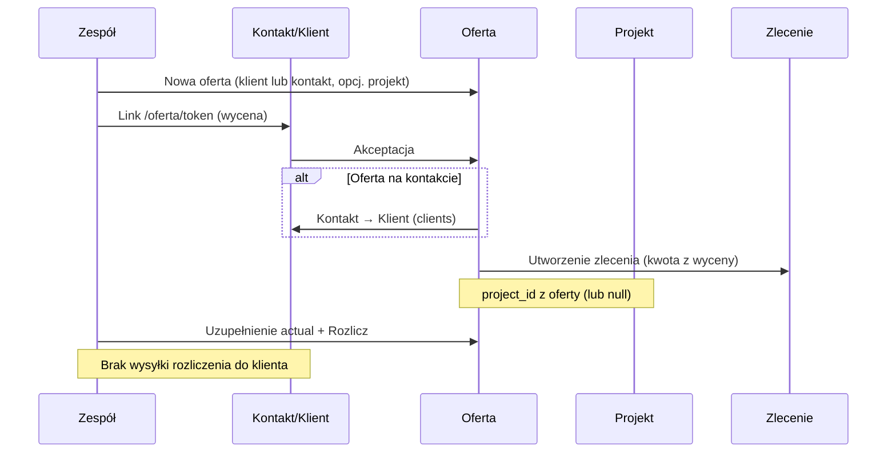

# Szybkie oferty — kontakty, klienci, projekty i zlecenia

Dokument opisuje moduł **Szybkie oferty** (oferty serwisowe w aplikacji: `/oferty`) oraz powiązania z **Kontaktami**, **Klientami**, **Projektami** i **Zleceniami**. Zawiera stan obecny w kodzie oraz zaplanowane zmiany (roadmapa).

## Słownik

| Pojęcie | Tabela / encja | Opis |
|--------|----------------|------|
| **Oferta (serwis)** | `services` | Wycena i ewentualne rozliczenie prac serwisowych. W UI: „Szybkie oferty”. |
| **Kontakt** | `contacts` | Lead — potencjalny klient, jeszcze nie w module Klienci. |
| **Klient** | `clients` | Stały kontrahent w bazie. |
| **Projekt** | `projects` | Obiekt / realizacja przypisana do klienta (`projects.client_id`). |
| **Zlecenie** | `work_orders` | Operacyjne zlecenie powstałe z zaakceptowanej oferty lub ręcznie. |

Oferta zawsze przechowuje **migawkę danych odbiorcy** w polach `client_*` (imię/nazwisko, lokalizacja, e-mail, telefon) oraz opcjonalnie powiązanie `client_id` lub `contact_id`.

## Mapa powiązań

```
                    ┌─────────────┐
                    │   Kontakt   │
                    │  (contacts) │
                    └──────┬──────┘
                           │ contact_id (opcjonalnie)
                           ▼
┌──────────┐    client_id   ┌─────────────┐    project_id    ┌──────────┐
│  Klient  │───────────────►│   Oferta    │─────────────────►│ Projekt  │
│ (clients)│                │  (services) │                  │(projects)│
└──────────┘                └──────┬──────┘                  └──────────┘
       ▲                            │
       │ konwersja kontaktu         │ service_id
       │ (akceptacja oferty)        ▼
       │                     ┌─────────────┐
       └─────────────────────│  Zlecenie   │
                             │(work_orders)│
                             └─────────────┘
```

## Stan obecny (implementacja)

### Tworzenie oferty

- **Nowa oferta:** [`/oferty/nowy`](/app/oferty/nowy/page.tsx)
- **Formularz:** [`ServiceForm`](/components/service/service-form.tsx)

Parametry URL przy tworzeniu:

| Parametr | Efekt |
|----------|--------|
| `clientId` | Podpięcie klienta, migawka z rekordu klienta |
| `contactId` | Podpięcie kontaktu, tryb „Kontakt” |
| `projectId` | Wstępne przypisanie projektu |

Wejścia z innych miejsc:

- Lista kontaktów → „Nowa oferta” (`?contactId=…`)
- Dashboard klienta → oferta z `?clientId=…&projectId=…`
- Zgłoszenie z formularza `/zgloszenie` → oferta z klientem/kontaktem po intake

### Klient vs kontakt w ofercie

Komponent [`CommercialPartyPicker`](/components/commercial-party-picker.tsx) pozwala przełączyć **Klient** / **Kontakt**:

- Wybór z listy lub **ręczne wpisanie** danych (opcja „Wpisz dane ręcznie”).
- Przy powiązanym rekordzie pola migawki są tylko do odczytu.
- Oferta może istnieć z samą migawką (`client_id` i `contact_id` = null) — walidacja wymaga jednak wypełnionych pól migawki.

**Kontakt → klient:** po **akceptacji oferty** przez kontakt ([`convertContactToClientServer`](/lib/supabase/contact-server.ts)) tworzy się rekord w `clients`, kontakt dostaje `converted_client_id`, oferta dostaje `client_id`.

Ręczna konwersja: przycisk „Stwórz klienta” na liście kontaktów (bez oferty).

### Projekt w ofercie

- Checkbox **„Oferta bez projektu”** — domyślnie włączony dla nowej oferty (`project_id = null`).
- Lista projektów pokazuje **wszystkie** projekty (bez filtrowania po kliencie).
- Projekt jest opcjonalny — brak walidacji wymuszającej `project_id`.

### Statusy oferty

| Status | Znaczenie |
|--------|-----------|
| Wycena | Przygotowywanie oferty |
| Oczekuje na klienta | Link wysłany, czeka na decyzję |
| Zaplanowany | Klient zaakceptował wycenę |
| W trakcie | Realizacja |
| Do rozliczenia | Po pracach, przed finalnym rozliczeniem |
| Rozliczony | Koszty rzeczywiste (`actual`) zatwierdzone w systemie |
| Anulowany | Odrzucona przez klienta |

### Link publiczny dla klienta

1. Zespół generuje link w zakładce **Klient** oferty ([`ClientOfferPanel`](/components/service/client-offer-panel.tsx)).
2. Klient otwiera `/oferta/[token]`.
3. Widok: [`ClientOfferPage`](/components/service/client-offer-page.tsx) + raport [`ServiceReport`](/components/service/service-report.tsx).

Klient może: **zaakceptować**, **odrzucić**, **poprosić o konsultację**, wybrać **pozycje opcjonalne**.

Przed rozliczeniem serwisu publiczny widok pokazuje **wycenę** (`estimate`), nie koszty rzeczywiste — logika w [`getPublicOfferView`](/lib/service/client-offer-public-view.ts).

### Akceptacja wyceny — co się dzieje

Plik: [`respondToClientOffer`](/lib/supabase/client-offer-repository.ts)

```
Klient akceptuje
    → status oferty: Zaplanowany
    → clientOffer.status: accepted
    → PDF zamrożony: client_offer_accepted_document (kwota z wyceny)
    → jeśli contact_id i brak client_id: konwersja kontaktu na klienta
    → createWorkOrderFromAcceptedService() — jedno zlecenie na service_id
```

Zlecenie ([`buildWorkOrderFromAcceptedService`](/lib/work-order/defaults.ts)):

- `source: "accepted_offer"`
- `service_id` — powiązanie z ofertą
- `project_id` — kopia z oferty (może być null)
- `client_id` — klient lub null przed konwersją
- `offer_gross_total` — brutto z zaakceptowanej wyceny
- `accepted_offer_document` — kopia PDF

Jeśli zlecenie już istnieje dla tego `service_id`, **nie jest nadpisywane** — zwracany jest istniejący rekord.

### Rozliczenie po wykonaniu prac

1. Zakładka **Rozliczenie** w `ServiceForm` — koszty rzeczywiste (`actual`).
2. Przycisk **Rozlicz** → status **Rozliczony**.
3. **Brak** drugiego linku do klienta z rozliczeniem (stan na dziś).
4. Po akceptacji wyceny **nie można** wygenerować nowego linku wyceny (`canGenerateClientOffer` = false).

### Zgłoszenie publiczne `/zgloszenie`

Gość lub zweryfikowany klient składa zgłoszenie → powstaje **kontakt** (lub dopięcie istniejącego po e-mailu) i często **oferta** z numerem `intake_reference`. To osobna ścieżka wejścia do tego samego ekosystemu kontaktów i ofert.

## Przepływ end-to-end (obecny)



## Roadmapa (zaplanowane zmiany)

Poniższe punkty są **jeszcze nie wdrożone** — wynikają z uzgodnionego planu rozwoju modułu.

### A. Imię i nazwisko (Kontakty / Klienci)

- Rozbicie `full_name` na `first_name` + `last_name`.
- Istniejące dane → pole **nazwisko**; wyszukiwanie, sortowanie i powiązania operacyjne nadal oparte o nazwisko.
- Publiczny formularz `/zgloszenie`: dwa pola → zapis do odpowiednich kolumn kontaktu.

### B. Wybór klienta/kontaktu i projektu w ofercie

| Zmiana | Docelowe zachowanie |
|--------|---------------------|
| Ręczne wpisywanie danych | **Wyłączone** — wymagany wybór klienta lub kontaktu z bazy |
| Brak klienta na liście | Przełączenie na **Kontakt**, przycisk **„Dodaj kontakt”** na **górze** listy |
| Sortowanie | Klienci i kontakty **A–Z po nazwisku** |
| Oferta bez projektu | **Wyłączona**, gdy wybrany klient ma ≥1 projekt; wtedy **wymagany** wybór projektu tego klienta |
| Brak projektów u klienta | Dopiero wtedy dozwolona „oferta bez projektu” |
| Kontakt | Zawsze może być bez projektu |
| Lista projektów | Tylko projekty wybranego klienta, sort A–Z |

### C. Dwa typy ofert

| Typ | `pricing_model` | Charakterystyka |
|-----|-----------------|-----------------|
| **Według stawek** | `hourly` | Stawki godzinowe, km, noclegi; rozliczenie po pracach |
| **Fixed price** | `fixed_price` | Wiele tabel pozycji (nazwa, ilość, jedn., cena, VAT); **bez** rozliczenia godzinowego |

**Fixed price:** tabele z opisem, wiersze z VAT (domyślny z oferty / 0 / 8 / 23%), podsumowanie per tabela i zbiorcze; rezerwa pod katalog produktów.

**Według stawek:** pozycje kosztów materiałowych (lista jak opcjonalne) zamiast jednego pola sumy; w linku klienta szczegóły lub suma wg „Pokaż szczegóły”.

### D. Ponowne wysłanie rozliczenia (tylko hourly)

Po statusie **Rozliczony**:

1. Osobny link **rozliczenia** (`settlement_offer_token`) — nie zastępuje zaakceptowanej wyceny.
2. Klient widzi koszty z `actual` (+ opcjonalnie porównanie z wyceną).
3. Po **akceptacji rozliczenia** — **nadpisanie** istniejącego zlecenia (nowa kwota brutto, nowy PDF), bez tworzenia duplikatu.

### E. Zlecenia i klienci bez projektu

- Lista zleceń: badge **„Bez projektu”** gdy `project_id` null.
- Lista klientów: wyróżnienie klientów **bez żadnego projektu**; w dashboardzie klienta CTA: przypisz projekt lub **utwórz projekt**.

## Macierz: kto jest w ofercie, projekt, zlecenie

| Scenariusz | `client_id` | `contact_id` | `project_id` | Po akceptacji wyceny | Zlecenie |
|------------|-------------|--------------|--------------|----------------------|----------|
| Istniejący klient + projekt | tak | nie | tak | Zaplanowany | Z projektem |
| Istniejący klient, bez projektu | tak | nie | null | Zaplanowany | Bez projektu — projekt trzeba utworzyć później |
| Kontakt (lead) | nie → **tak** po akceptacji | tak | zwykle null | Konwersja + Zaplanowany | Bez projektu do ręcznego utworzenia |
| Ręczna migawka (dziś) | nie | nie | dowolnie | Zależnie od akceptacji | Z danymi migawki |

## Kluczowe pliki w repozytorium

| Obszar | Pliki |
|--------|--------|
| Formularz oferty | `components/service/service-form.tsx` |
| Wybór klienta/kontaktu | `components/commercial-party-picker.tsx` |
| Link i wysyłka | `components/service/client-offer-panel.tsx` |
| Publiczny widok | `components/service/client-offer-page.tsx`, `app/oferta/[token]/page.tsx` |
| API akceptacji | `app/api/oferta/[token]/route.ts`, `lib/supabase/client-offer-repository.ts` |
| Konwersja kontaktu | `lib/supabase/contact-server.ts` |
| Zlecenia | `lib/supabase/work-order-repository.ts`, `lib/work-order/defaults.ts` |
| Typy | `lib/service/types.ts`, `lib/contacts/types.ts` |
| Store | `store/service-store.ts`, `store/app-store.ts`, `store/work-order-store.ts` |

## Powiązane dokumenty

- Plan wdrożenia zmian: `.cursor/plans/kontakty_oferty_zlecenia_ux_b61bf8ea.plan.md` (w repozytorium Cursor)
- Integracja SMS przy tworzeniu klienta: [`docs/sms-integration.md`](sms-integration.md)

## FAQ

**Czy oferta musi mieć klienta?**  
Dziś nie — wystarczy migawka. Docelowo: wymagany `client_id` **lub** `contact_id`.

**Czy kontakt może zaakceptować ofertę bez bycia klientem?**  
Tak. Akceptacja automatycznie tworzy klienta i kopiuje dane.

**Czy jedna oferta może mieć wiele zleceń?**  
Nie — jedno zlecenie na `service_id` (idempotentne tworzenie).

**Czy rozliczenie zmienia zlecenie?**  
Dziś nie. Docelowo: po akceptacji **rozliczenia** przez klienta — nadpisanie kwoty i PDF na istniejącym zleceniu.

**Czy fixed price ma rozliczenie godzinowe?**  
Nie — tylko wycena z tabel pozycji; brak zakładki rozliczenia jak przy stawkach.
